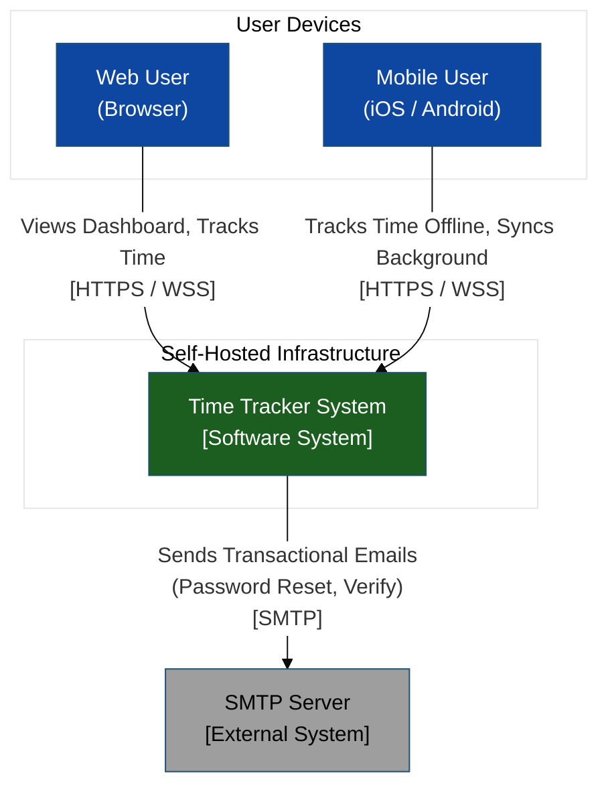
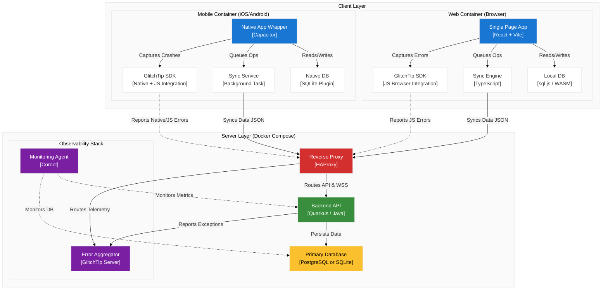
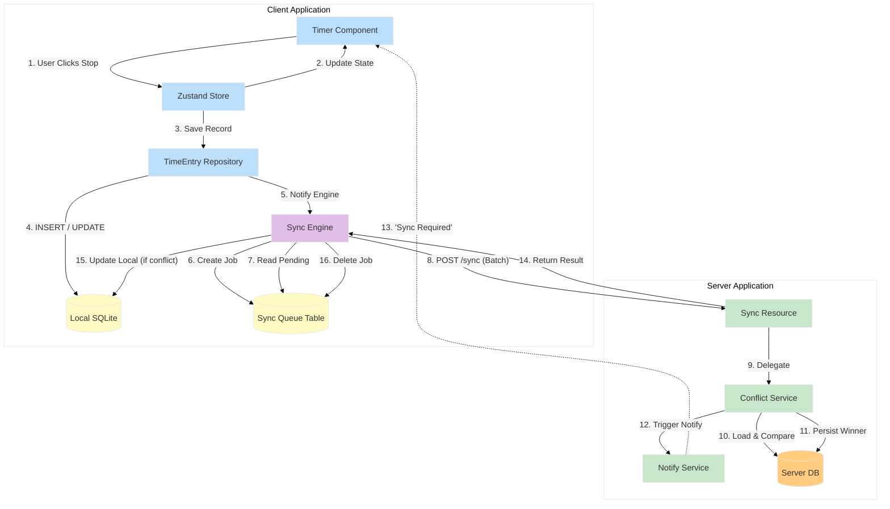
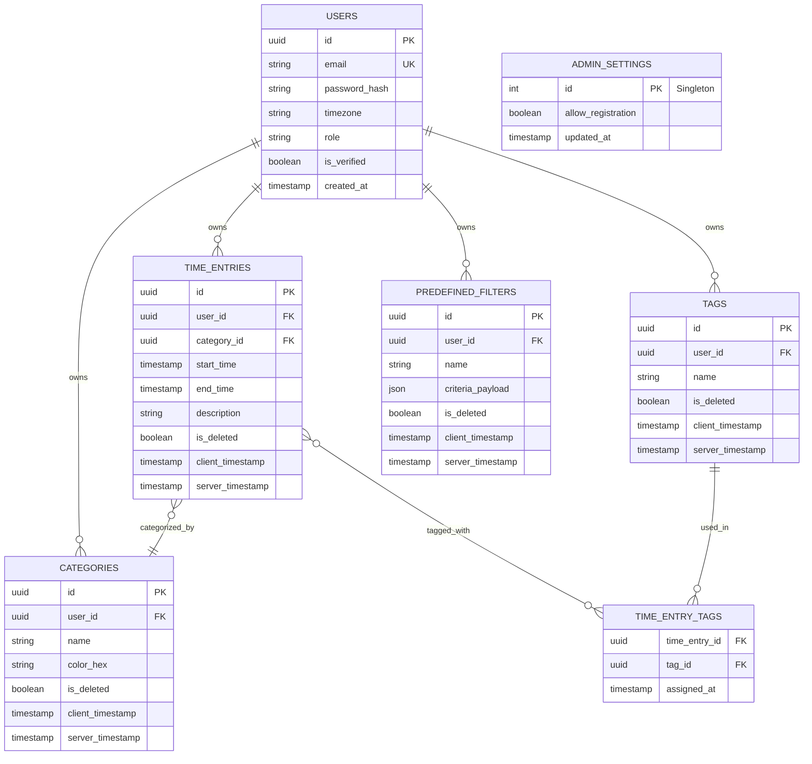
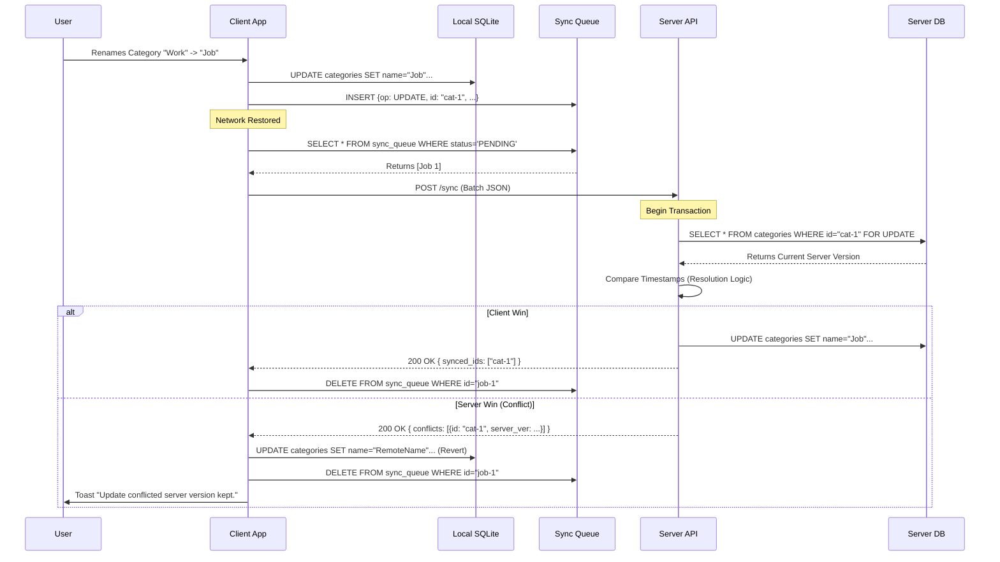
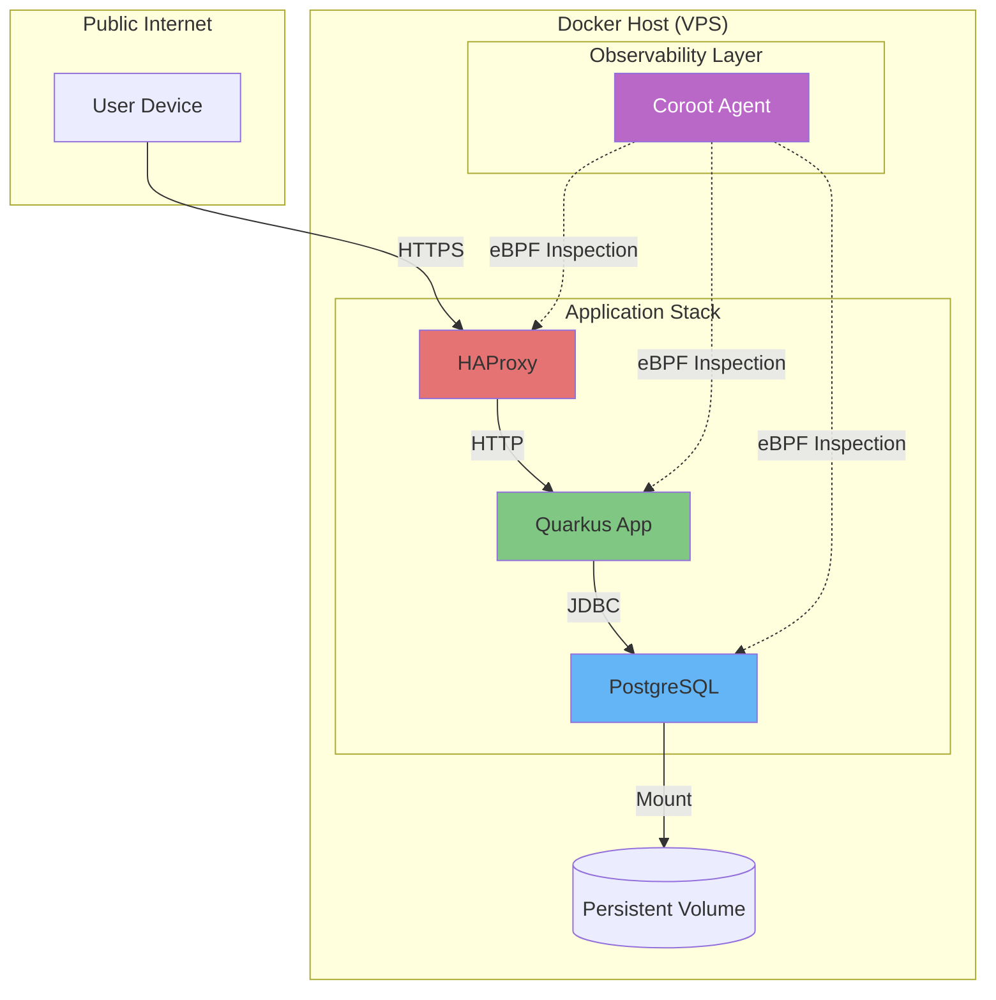

# Design and Architecture Document: Time Tracker System

## 1\. Introduction

### 1.1 Purpose of This Document

### 1.2 Scope

### 1.3 Definitions, Acronyms, and Abbreviations

### 1.4 References

### 1.5 Document Conventions

## 2\. Architectural Goals, Constraints, and Technology Stack

### 2.1 Quality Attribute Scenarios

### 2.2 Key Design Principles

### 2.3 Technical and Operational Constraints

### 2.4 Selected Technology Stack

## 3\. High-Level Architecture Overview

### 3.1 Architectural Style(s) Used

### 3.2 Context Diagram

### 3.3 Container Diagram

## 4\. Component Architecture

### 4.1 Client Layer

### 4.2 Application Server

### 4.3 Data Layer

### 4.4 Component Diagram

## 5\. Data Architecture

### 5.1 Conceptual Data Model

### 5.2 Logical Data Schema

### 5.3 UUID-Based Identity Strategy

### 5.4 Soft Delete & Tombstone Propagation

### 5.5 Local vs. Server Data Partitioning

## 6\. Synchronization Design

### 6.1 Sync Engine Workflow

### 6.2 Conflict Detection & Resolution Logic

### 6.3 Sync Queue Structure

### 6.4 Sequence Diagram

## 7\. Security Architecture

### 7.1 Authentication Flow

### 7.2 Secure Token Storage

### 7.3 Data Isolation

### 7.4 Password Hashing

### 7.5 Threat Model Summary

## 8\. Deployment Architecture

### 8.1 Self-Hosting Topology

### 8.2 Docker Compose Setup

### 8.3 Environment Support Matrix

### 8.4 Health & Monitoring Endpoints

### 8.5 Deployment Diagram

## 9\. Cross-Cutting Concerns

### 9.1 Error Handling & Logging

### 9.2 Internationalization

### 9.3 Accessibility

### 9.4 Performance Optimizations

## 10\. Quality Assurance and Software Verification

### 10.1 Testing Strategy

### 10.2 Test Environments

### 10.3 Key Test Scenarios

### 10.4 Performance & Load Validation

### 10.5 Security Verification

### 10.6 Compliance & Auditability

### 10.7 Monitoring & Observability

## 11\. Open Issues and Future Considerations

### 11.1 Known Ambiguities

### 11.2 Potential Extensions

---

# 1. Introduction

## 1.1 Purpose of This Document

This Design and Architecture Document (DAD) serves as the authoritative technical blueprint for the **Time Tracker System**. It translates the business requirements defined in the *Functional Requirements Document (FRD)* into concrete architectural decisions, component specifications, data models, and interface definitions.

The primary purpose of this document is to:
1.  **Enforce Architectural Constraints:** Explicitly define the boundaries for the "Local-First" and "Self-Hostable" paradigms to prevent architectural drift during implementation.
2.  **Standardize the Sync Protocol:** rigorize the data synchronization logic, conflict resolution strategies, and offline state management which form the core complexity of this system.
3.  **Guide Implementation:** Provide Engineering, DevOps, and QA teams with actionable specifications for the React/Capacitor frontend, Quarkus backend, and Docker-based infrastructure.

This document takes precedence over verbal discussions. Any deviation from the architectural patterns defined herein requires a formal Request for Comments (RFC) process.

## 1.2 Scope

This document covers the end-to-end architecture for the MVP (Minimum Viable Product) of the Time Tracker System.

**In Scope:**
*   **Unified Client Architecture:** Design of the single-codebase React application serving as the Web Client (PWA) and Mobile Clients (iOS/Android via Capacitor).
*   **Offline-First Data Layer:** Specification of the local SQLite storage, 7-day rolling cache strategy, and the store-and-forward sync engine.
*   **Backend Services:** Architecture of the Quarkus-based REST API, Authentication (JWT), and WebSocket notification layer.
*   **Data Persistence:** Schema design supporting dual-mode deployment:
    *   **Lightweight:** SQLite (Single-file, embedded).
    *   **Production:** PostgreSQL (Containerized, multi-user).
*   **Deployment Model:** Docker Compose configuration for "one-click" self-hosting.

**Out of Scope:**
*   **Native Desktop Applications:** Windows (.exe) or macOS (.app) native wrappers are excluded; desktop users are served via the Web Client.
*   **SaaS-Specific Features:** Multi-tenant billing, subscription management, or cloud-hosted payment gateways.
*   **Legacy Data Migration:** Tooling to import data from the original "Simple Time Tracker" Android app or other third-party tools.

## 1.3 Definitions, Acronyms, and Abbreviations

To ensure semantic precision, the following terms are defined as they apply to this specific architecture:

| Term | Definition |
| :--- | :--- |
| **Local-First** | An architectural paradigm where the client reads/writes to its embedded database *first*. The network is treated as a secondary synchronization channel, not the primary data source. |
| **Optimistic UI** | A frontend pattern where the UI updates immediately upon user action (assuming success) without waiting for a server round-trip. |
| **Tombstone** | A record marker (typically `is_deleted=true`) retained in the database to propagate deletion events to other devices during synchronization. |
| **Sync Queue** | A persistent, ordered list of mutation operations (CREATE, UPDATE, DELETE) stored on the client, waiting to be replayed against the server. |
| **UUID v4** | Universally Unique Identifier (Version 4). Used as the Primary Key for *all* entities to allow ID generation on offline clients without collision risk. |
| **Soft Delete** | The practice of marking a record as deleted rather than physically removing the row, essential for preserving referential integrity in distributed sync histories. |
| **Quarkus** | A Kubernetes Native Java framework tailored for GraalVM and HotSpot, selected here for its low memory footprint and fast startup time essential for self-hosting on low-end hardware. |
| **Capacitor** | A cross-platform native runtime that allows the React web application to run as a native iOS/Android app with access to device hardware (filesystem, SQLite). |
| **JWT** | JSON Web Token. A stateless authentication token used for API authorization. |
| **RBAC** | Role-Based Access Control. |

## 1.4 References

1.  **Functional Requirements Document (FRD)** – *Time Tracker System FRD v1.0*
2.  **C4 Model** – *The C4 model for visualizing software architecture* (Simon Brown).
3.  **RFC 4122** – *A Universally Unique IDentifier (UUID) URN Namespace*.
4.  **ISO 8601** – *Date and time format standard* (Strict adherence required for all API timestamps).
5.  **Quarkus Documentation** – [https://quarkus.io](https://quarkus.io)
6.  **Capacitor Documentation** – [https://capacitorjs.com](https://capacitorjs.com)

## 1.5 Document Conventions

*   **Requirement Levels:** The key words "MUST", "MUST NOT", "REQUIRED", "SHALL", "SHALL NOT", "SHOULD", "SHOULD NOT", "RECOMMENDED", "MAY", and "OPTIONAL" in this document are to be interpreted as described in **RFC 2119**.
*   **Diagramming:** All architectural diagrams use the **C4 Model** notation (Context, Containers, Components, Code) and are rendered using **Mermaid.js**.
*   **Technology Specifics:** Where configuration examples are provided (e.g., `docker-compose.yml`, `application.properties`), they represent the *production-intent* configuration, not local development overrides.

---

# 2. Architectural Goals, Constraints, and Technology Stack

## 2.1 Quality Attribute Scenarios (Architectural Drivers)

The architecture is shaped by specific quality attributes that prioritize **Availability** (Offline capability) and **Portability** (Self-hosting) over massive horizontal scalability.

| Attribute | Scenario | Architectural Response |
| :--- | :--- | :--- |
| **Availability (Offline)** | A user on a flight (no network) starts a timer, renames a category, and checks their weekly history. | **Local-First Architecture:** All reads/writes target the local embedded SQLite database. The network is completely bypassed for user interactions. |
| **Data Integrity** | A user edits the same Time Record on Mobile (offline) and Web (online) simultaneously. | **Eventual Consistency:** Synchronization logic utilizes a deterministic "Last-Write-Wins" policy based on client-side timestamps. Soft-deletes and UUIDs prevent ID collisions and referential corruption. |
| **Portability (Self-Hosting)** | A user deploys the full stack on a Raspberry Pi 4 (2GB RAM). | **Resource Efficiency:** The backend utilizes **Quarkus** (Sub-atomic Java) and **HAProxy**, targeting a total idle memory footprint of <300MB for the entire container stack. |
| **Observability** | An instance running in a user's private home network crashes. The user needs to know why without SSH-ing into the container. | **Embedded Telemetry:** The stack includes **GlitchTip** (Sentry-compatible) and **Coroot** for self-contained error tracking and metric visualization, accessible via the web UI. |
| **Responsiveness** | A user taps "Stop Timer". | **Optimistic UI:** The UI updates the state immediately in memory and persists to local DB asynchronously. The sync queue processes the request in the background. Latency is perceived as <50ms regardless of network status. |

## 2.2 Key Design Principles

1.  **Local-First & Offline-First:** The client application must function 100% without a network connection. The server is treated as a "Synchronization Peer" and "Backup Target," not the primary engine of user interaction.
2.  **Operational Minimalism:** The system is designed for "Set and Forget." It favors monolithic containerization (all-in-one Compose) over microservices to reduce operational overhead for self-hosters.
3.  **Data Sovereignty:** The architecture guarantees that the user owns the encryption keys, the database file, and the backup mechanism. No telemetry is sent to third-party clouds.
4.  **Database Agnosticism:** The Data Access Layer uses Hibernate/Panache to abstract the underlying SQL dialect, supporting both **SQLite** (for simple deployments) and **PostgreSQL** (for robust multi-user deployments) with a single codebase.

## 2.3 Technical and Operational Constraints

*   **Memory Budget:** The core application containers (Backend + Proxy) MUST operate within **512MB RAM** to ensure viability on low-cost VPS tiers and hobbyist hardware.
*   **Mobile Constraints:** The Capacitor mobile app MUST handle background execution restrictions imposed by iOS/Android (e.g., rigid limits on background sync tasks).
*   **Connectivity:** The system MUST tolerate high-latency, intermittent, and low-bandwidth connections (e.g., 2G/3G networks) without data corruption.
*   **Security:** All ingress traffic MUST be encrypted via TLS. The self-hosted environment implies we cannot rely on external WAFs; basic rate-limiting must be handled at the ingress (HAProxy) level.
*   **Browser Compatibility:** The Web Client relies on modern APIs (Service Workers, IndexedDB/OPFS). Support is limited to "Evergreen Browsers" (Chrome, Firefox, Safari, Edge - last 2 major versions).

## 2.4 Selected Technology Stack

The following technology choices maximize developer velocity while adhering to the strict resource and offline constraints.

### 2.4.1 Client Layer (Web & Mobile)

| Component | Selection | Architectural Justification |
| :--- | :--- | :--- |
| **Framework** | **React + Vite** | High performance, smaller bundle sizes than Create-React-App, and a vast ecosystem for UI logic. |
| **State Management** | **Zustand** | **Crucial Choice.** Selected over Redux/Context for its simplicity and ability to work outside the React component tree (essential for the background Sync Engine logic). |
| **UI Library** | **Bootstrap 5** | Mature, accessible, and responsive grid system. Selected for stability and ease of customization via SCSS variables. |
| **Mobile Runtime** | **Capacitor** | Allows a "Write Once, Run Everywhere" strategy. Provides critical native bridges for **SQLite** and **Background Tasks** that PBAs (Progressive Web Apps) cannot reliably guarantee on iOS. |
| **Local Database** | **SQLite** | **Web:** `sql.js` (WASM) / **Mobile:** `@capacitor/sqlite`. Provides a full SQL relational engine on the client, enabling complex queries (aggregations, history filtering) offline without reinventing filtering logic in JS. |
| **Icons** | **Material Symbols** | Unified design language; delivered as SVGs to minimize font payload. |

### 2.4.2 Backend Layer

| Component | Selection | Architectural Justification |
| :--- | :--- | :--- |
| **Runtime** | **Quarkus (Java 21+)** | **Critical Choice.** Chosen over Spring Boot for its "Supersonic Subatomic" memory profile and fast startup time (<1s). Ideal for containerized, resource-constrained environments. |
| **Language** | **Java** | Strong typing, massive ecosystem, and robust concurrency models for handling WebSocket connections. |
| **API Protocol** | **REST (JAX-RS)** | Standard resource manipulation. |
| **Real-Time** | **WebSockets** | Used strictly for **Signaling** ("Sync Required" notifications), not for data transport. This decouples real-time notifications from data consistency logic. |
| **ORM** | **Hibernate Panache** | Simplifies data access while handling the dialect differences between PostgreSQL and SQLite transparently. |
| **DB Migration** | **Flyway** | **Critical for Self-Hosting.** Automates schema upgrades upon container startup. Ensures that when a user pulls a new Docker image, their database is upgraded safely without manual SQL script execution. |
| **Security** | **SmallRye JWT** | Stateless authentication. Eliminates the need for server-side session storage (Redis), further reducing the infrastructure footprint. |

### 2.4.3 Infrastructure & Observability

| Component | Selection | Architectural Justification |
| :--- | :--- | :--- |
| **Ingress / Load Balancer** | **HAProxy** | Extremely lightweight (vs Nginx/Traefik). Handles TLS termination, Rate Limiting (DoS protection), and routing for both HTTP and WebSocket traffic. |
| **Database (Prod)** | **PostgreSQL 16** | The gold standard for data integrity and complex queries in a multi-user environment. |
| **Database (Lite)** | **SQLite** | Option for single-user/embedded deployments. |
| **Error Tracking** | **GlitchTip** | Open-source, self-hostable Sentry alternative. Allows the user to capture frontend and backend crashes within their own infrastructure. |
| **Monitoring** | **Coroot** | eBPF-based observability. Auto-discovers service maps and metrics from Docker containers without requiring heavy sidecars or manual instrumentation. |
| **Containerization** | **Docker Compose** | The universal standard for self-hosted orchestration. |

### 2.4.4 Real-Time Sync Strategy (Clarification)

While **WebSockets** are included in the stack, their role is architecturally limited to **Signaling**.

*   **Mechanism:** Server sends a lightweight `{ "event": "sync_required" }` packet to connected clients.
*   **Action:** Clients react by triggering their standard REST-based synchronization flow.
*   **Reasoning:** This avoids the complexity of guaranteeing message delivery over ephemeral sockets. If the socket drops, the client simply syncs on the next reconnect or background polling interval. This maintains the **Offline-First** reliability guarantee.
---

# 3. High-Level Architecture Overview

This chapter defines the structural design of the Time Tracker System. It identifies the system's boundaries, the external entities it interacts with, and the logical containers that execute the code.

The architecture is designed as a **Hybrid Distributed System**:
1.  **Thick Clients (Mobile/Web):** Possess full application logic and a local database, capable of autonomous operation.
2.  **Stateless Server:** Acts as the synchronization hub and authoritative backup.
3.  **Containerized Infrastructure:** Ensures consistent deployment across self-hosted environments.

## 3.1 Architectural Style

The system employs a **Local-First, Cloud-Sync** architectural style.

*   **Primary Interaction Pattern:** Clients perform all Create, Read, Update, and Delete (CRUD) operations against a **Local SQLite Replica**.
*   **Secondary Interaction Pattern:** An asynchronous **Sync Engine** replicates changes between the Local SQLite and the Server Database via REST API.
*   **Consistency Model:** **Eventual Consistency**. The system guarantees that all devices will converge to the same state given sufficient connectivity, using a "Last-Write-Wins" conflict resolution strategy.

## 3.2 Context Diagram (System Landscape)

The Context Diagram illustrates the Time Tracker System's boundaries and its relationship with users and external systems.



**Key Interactions:**
*   **Users:** Interact exclusively with the Time Tracker System.
*   **SMTP Server:** The only external dependency (optional) required for transactional emails (e.g., password resets). If missing, the system operates with limited administrative functionality.

## 3.3 Container Diagram (Runtime Units)

The Container Diagram zooms into the "Time Tracker System" to show the deployable units and their responsibilities. It highlights the distinct error reporting pathways for Web vs. Mobile.



### 3.3.1 Container Responsibilities

| Container | Tech Stack | Responsibility |
| :--- | :--- | :--- |
| **Web Client** | React, Vite, sql.js | Runs in the browser. Uses WASM-based SQLite for local storage. Handles UI rendering and standard "online" sync. |
| **Mobile Client** | React, Capacitor, SQLite Plugin | Runs as a native app. Uses the device's native SQLite engine for storage. Manages OS-level background tasks for sync and handles native permission dialogs. |
| **HAProxy** | HAProxy | The single entry point (Ingress). Handles TLS termination, basic Rate Limiting, and routing traffic to the API or GlitchTip based on URL path. |
| **Backend API** | Quarkus (Java) | Stateless business logic. Validates tokens, handles conflict resolution, executes sync merging, and manages WebSocket signals. |
| **Primary Database** | PostgreSQL *or* SQLite | The "Source of Truth." Stores the complete history of all records, user accounts, and system configuration. |
| **GlitchTip** | Django/Celery (internal) | Receives error reports from Client JS, Mobile Native layers, and the Backend API. Provides a unified dashboard for crash analysis. |
| **Coroot** | Go / eBPF | Passive monitoring. Analyzes container traffic to build service maps and detect latency spikes without requiring code instrumentation. |

### 3.3.2 Error Reporting Strategy

A critical distinction exists in how errors are captured across platforms:

1.  **Web Client:**
    *   **Scope:** Captures JavaScript Runtime Errors (React Error Boundary) and Unhandled Promise Rejections.
    *   **Transport:** Sends payloads directly to the GlitchTip endpoint via HTTPS.
    *   **Limitation:** Cannot capture browser crashes or network layer failures if the browser process dies.

2.  **Mobile Client:**
    *   **Scope:** Captures JavaScript Errors **PLUS** Native Layer Crashes (e.g., Java/Kotlin exceptions on Android, Obj-C/Swift exceptions on iOS).
    *   **Implementation:** Utilizes the GlitchTip Capacitor plugin which hooks into the native OS crash handler.
    *   **Resilience:** If a crash occurs offline, the native SDK caches the stack trace and attempts to upload it upon the next app launch/network recovery.

3.  **Backend API:**
    *   **Scope:** Captures 500 Internal Server Errors and Uncaught Exceptions within Quarkus.
    *   **Context:** Enriches error reports with Request ID, User ID (if auth'd), and relevant HTTP headers.

---

# 4. Component Architecture

This chapter decomposes the high-level containers into logical software components. It defines the internal structure of the unified frontend application and the backend services, detailing their responsibilities, boundaries, and interaction patterns.

## 4.1 Client Layer (Unified Frontend)

The client is a single React codebase that adapts its behavior based on the runtime environment (Browser vs. Capacitor). It follows a **Modular Monolith** pattern within the frontend.

### 4.1.1 Core Components

1.  **UI Shell & Routing**
    *   **Responsibility:** Manages the application lifecycle, navigation (React Router), and layout (Bootstrap 5).
    *   **Logic:** Determines which views are accessible based on Authentication State.
    *   **Components:** `AppShell`, `NavBar`, `Sidebar`, `AuthGuard`.

2.  **Global State Store (Zustand)**
    *   **Responsibility:** Holds transient application state (e.g., "Is Syncing?", "Current User", "Active Timer ID").
    *   **Pattern:** Uses atomic stores/slices to prevent unnecessary re-renders. Decoupled from the persistent database.
    *   **Key Slices:** `useAuthStore`, `useSyncStore`, `useTimerStore`.

3.  **Local Data Access Layer (DAL)**
    *   **Responsibility:** Provides a typed, Promise-based API for all database operations, abstracting the underlying SQLite driver.
    *   **Abstraction Strategy:**
        *   **Interface:** `IDatabaseDriver` (methods: `query`, `execute`, `transaction`).
        *   **Implementations:**
            *   `WebSqliteDriver`: Wraps `sql.js` (WASM) and handles persistence via IndexedDB/OPFS.
            *   `NativeSqliteDriver`: Wraps `@capacitor/sqlite` for direct native calls.
    *   **Repositories:** `TimeEntryRepository`, `CategoryRepository`, `SyncQueueRepository`.

4.  **Sync Engine (The "Brain")**
    *   **Responsibility:** Orchestrates data movement between Local DB and Server. Runs as a singleton service, detached from the UI render cycle.
    *   **Internal logic:**
        *   **Watcher:** Listens for "Mutation Events" from Repositories.
        *   **Queue Manager:** Serializes mutations into the `sync_queue` table.
        *   **Transport:** Batches pending items and executes POST `/api/v1/sync`.
        *   **Merger:** Processes the server response, updates local records, and purges the queue.
    *   **Triggers:** App Launch, Network Recovery (`window.ononline`), WebSocket Signal, Timer Stop event.

5.  **Error & Telemetry Agent**
    *   **Responsibility:** Initializes GlitchTip SDKs based on platform.
    *   **Context:** Wraps API calls to inject breadcrumbs (e.g., "User clicked Save") before a crash occurs.

## 4.2 Application Server (Backend)

The backend is a **Quarkus** application structured around **Domain-Driven Design (DDD)** principles, separating the API layer from business logic and data access.

### 4.2.1 Core Components

1.  **API Gateway Layer (JAX-RS)**
    *   **Responsibility:** Exposes REST endpoints, handles HTTP Request/Response mapping, and performs input validation (Bean Validation).
    *   **Resources:**
        *   `AuthResource`: Login, Token Refresh.
        *   `SyncResource`: The primary data pipe. Accepts generic Sync Batches.
        *   `AdminResource`: User management (Role: Admin only).

2.  **Security & Identity Module**
    *   **Responsibility:** Validates JWTs, enforces RBAC, and manages password hashing (Argon2).
    *   **Interceptor:** A global JAX-RS filter checks the `Authorization: Bearer` header and extracts the `user_id`.
    *   **Context:** Injects the `user_id` into a Request Scoped Bean (`UserContext`), ensuring downstream services don't need to parse the token again.

3.  **Conflict Resolution Domain Service**
    *   **Responsibility:** The core business logic for the `SyncResource`.
    *   **Algorithm:**
        1.  Locks the user's records (row-level lock) to prevent concurrent sync races.
        2.  Iterates through the incoming Batch.
        3.  Loads the corresponding Server Record (if exists).
        4.  Compares `client_timestamp` vs `server_timestamp`.
        5.  **Decision:** Applies update or discards incoming change.
        6.  Returns the "Winner" to the client.

4.  **Notification Service (WebSocket)**
    *   **Responsibility:** Manages active WebSocket sessions.
    *   **Map:** Maintains a thread-safe registry: `Map<UserId, List<Session>>`.
    *   **Trigger:** When `SyncResource` successfully commits a write for `User A`, this service looks up `User A`'s sessions and broadcasts `{ "type": "SYNC_REQUIRED" }`.

5.  **Multi-Tenancy Enforcer (Hibernate Filter)**
    *   **Responsibility:** A failsafe mechanism to prevent data leaks.
    *   **Mechanism:** A Hibernate Filter (`@FilterDef`) applied globally to all Sessions.
    *   **Logic:** `WHERE user_id = :currentUserId`.
    *   **Safety:** This ensures that even if a developer forgets to add `.where("user_id", ...)` in a query, the database layer will filter the results automatically.

## 4.3 Component Interaction Diagram

The following diagram details the flow of a "Stop Timer" action, tracing it from the UI component through the Sync Engine to the Backend and back.



## 4.4 Data Layer Architecture

### 4.4.1 Repository Pattern & Abstraction
To support the dual-database requirement (SQLite/Postgres) on the backend and the SQLite requirement on the frontend, the system strictly adheres to the Repository Pattern.

*   **Frontend:** `BaseRepository<T>` handles generic CRUD logic. Concrete repositories (e.g., `CategoryRepo`) implement domain-specific queries using raw SQL compatible with `sql.js`.
*   **Backend:** Panache Repositories (`implements PanacheRepositoryBase<Entity, UUID>`) handle all database interactions. Raw SQL is avoided in favor of HQL/JPQL to ensure dialect portability.

### 4.4.2 Cross-Platform Logic Sharing
While code cannot be shared directly between the Java backend and JS frontend, the **Logic Definitions** are shared via:
*   **TypeScript Interfaces (Frontend):** Directly mirrored from Java DTOs.
*   **Validation Rules:** Regex patterns (e.g., for email, password complexity) and constraints (max lengths) are defined in a shared JSON configuration file that is consumed by both the Frontend validation logic and the Backend Bean Validation.
I have updated **Chapter 5: Data Architecture** to include the detailed specifications for the **Tags** and **Predefined Filters** (Saved Views) tables.
---

# 5. Data Architecture

This chapter defines the data models, storage strategies, and partitioning logic that underpin the system's ability to function as a distributed, offline-first application.

## 5.1 Conceptual Data Model

The domain model is divided into three distinct scopes based on ownership and lifecycle:

1.  **User Content (Replicated):** Entities owned by a specific user. These are created offline, synced bi-directionally, and strictly isolated.
    *   *Entities:* `TimeEntry`, `Category`, `Tag`, `PredefinedFilter`.
2.  **Identity Data (Server-Only):** Entities managing access and security. These exist *only* on the server database to prevent tampering.
    *   *Entities:* `User`, `RefreshToken`.
3.  **System Configuration (Singleton):** Global settings for the self-hosted instance.
    *   *Entity:* `AdminSettings`.

## 5.2 Logical Data Schema

The schema creates a "Least Common Denominator" structure compatible with both SQLite types (TEXT, INTEGER, REAL) and PostgreSQL types (UUID, TIMESTAMP, BOOLEAN).

### 5.2.1 Entity Relationship Diagram (ERD)



### 5.2.2 Key Table Definitions

#### A. Tagging System (`tags`, `time_entry_tags`)
Tags allow cross-functional grouping (e.g., "Deep Work" tag applied to both "Coding" and "Writing" categories).

**Table: `tags`**
| Column | Type | Description |
| :--- | :--- | :--- |
| `id` | UUID | Primary Key. Client-generated. |
| `user_id` | UUID | Foreign Key. Partition Key. |
| `name` | TEXT | Display name (e.g., "Urgent"). Case-insensitive unique constraint per user. |
| `is_deleted` | BOOLEAN | Soft-delete flag. |
| `client_timestamp` | TIMESTAMP | Last write wins basis. |

**Table: `time_entry_tags` (Junction Table)**
*Architectural Note: In SQLite, this is a standard link table. Syncing this requires handling the relationship explicitly.*
| Column | Type | Description |
| :--- | :--- | :--- |
| `time_entry_id` | UUID | FK to `time_entries`. Cascade Delete (Soft). |
| `tag_id` | UUID | FK to `tags`. |

#### B. Saved Views (`predefined_filters`)
Stores user-configured dashboard filters (e.g., "My Morning Work" view) so they persist across devices.

| Column | Type | Description |
| :--- | :--- | :--- |
| `id` | UUID | Primary Key. |
| `user_id` | UUID | Foreign Key. |
| `name` | TEXT | Display name (e.g., "Last Month's Work"). |
| `criteria_payload` | JSON / TEXT | Stores the filter logic. Structure: `{ "category_ids": [...], "tag_ids": [...], "date_range": "last_30_days", "text_search": "Project A" }`. |
| `is_deleted` | BOOLEAN | Soft-delete flag. |
| `client_timestamp` | TIMESTAMP | Last write wins basis. |

#### C. User Content Core (`time_entries`, `categories`)
*(Unchanged from previous iteration - see 5.2.2 A)*

#### D. System Singleton (`admin_settings`)
*(Unchanged from previous iteration - see 5.2.2 B)*

## 5.3 UUID Strategy & Identity Generation

To support offline creation without collisions, the system relies entirely on **Client-Side UUID v4 Generation**.

*   **Constraint:** The Server Database MUST NOT use auto-incrementing integers for `id` columns in user content tables.
*   **Collision Risk:** Mathematically negligible.
*   **Implementation:**
    *   **Frontend:** `crypto.randomUUID()` (Web/Node standard).
    *   **Backend:** `java.util.UUID`.

## 5.4 Data Partitioning & 7-Day Cache Strategy

To optimize mobile performance and storage while providing access to historical data, the system implements a **Tiered Storage Architecture**.

### 5.4.1 Tier 1: Local "Hot" Data (Client SQLite)
*   **Retention Scope:**
    *   **Time Entries:** Current Time minus 7 Days (rolling window) + All Future entries.
    *   **Categories/Tags/Filters:** All (Always synced fully).
    *   **Unsynced Changes:** All (Regardless of age).
*   **Pruning Logic:** The Sync Engine runs a `VACUUM` job after every successful sync batch:
    ```sql
    DELETE FROM time_entries 
    WHERE end_time < date('now', '-7 days') 
      AND status = 'SYNCED';
    ```

### 5.4.2 Tier 2: Server "Cold" Data (Postgres/SQLite)
*   **Retention Scope:** 100% of data history.
*   **Access Pattern:**
    *   **Sync:** Pushes updates to Tier 1.
    *   **Reporting:** Client requests aggregation (SUM/AVG) over date ranges outside the 7-day window. The Server computes the result and returns lightweight JSON stats.
    *   **On-Demand Fetch:** Explicit fetch by date (e.g., `GET /api/v1/entries?date=YYYY-MM-DD`).

## 5.5 Soft Delete & Tombstones

The "Soft Delete" pattern is the only way to propagate deletions in an eventually consistent system.

1.  **User Action:** User deletes "Urgent" tag (Offline).
2.  **Local State:**
    *   `UPDATE tags SET is_deleted = 1, client_timestamp = NOW() WHERE id = 'tag_123'`.
    *   `DELETE FROM time_entry_tags WHERE tag_id = 'tag_123'` (Local cleanup of associations).
3.  **Sync:** The record `{ id: 'tag_123', is_deleted: true }` is sent to the Server.
4.  **Propagation:** Device B pulls updates. It receives the tombstone and executes the same local cleanup.

## 5.6 Multi-Tenancy & Isolation

The system is designed for **Logical Multi-Tenancy** within a shared schema.

*   **Row-Level Isolation:** Every user-content table MUST have a `user_id` column.
*   **Application-Level Enforcement:** The Backend API layer is the boundary. It injects the `user_id` from the JWT into every repository call.
*   **Database-Level Enforcement:** Security is enforced by the Application Code (Hibernate Filter) rather than RLS, ensuring compatibility across PostgreSQL and SQLite backend profiles.

 
---

# 6. Synchronization Design

This chapter specifies the mechanism that enables **Offline Continuity** and **Eventual Consistency**. It defines the protocol for exchanging data between the Local SQLite Replica (Client) and the Central Database (Server), ensuring that user intent is preserved even in the presence of network failures and concurrent edits.

## 6.1 Sync Architecture Pattern

The system implements a **Client-Initiated, Delta-Based Sync Protocol**.

*   **Client-Initiated:** The Server is passive. Clients decide when to push changes or pull updates.
*   **Delta-Based:** Only changed records (Create, Update, Delete) are transmitted, minimizing bandwidth usage (critical for mobile data).
*   **Batch Processing:** Operations are grouped into transactional batches to ensure atomicity at the HTTP level.

### 6.1.1 The Sync Engine State Machine
The Sync Engine (running on the Client) operates as a finite state machine:

1.  **IDLE:** Monitoring the `sync_queue` table and network status.
2.  **COLLECTING:** Gathering pending local operations (`status='PENDING'`) into a JSON batch.
3.  **TRANSMITTING:** Sending the batch via `POST /api/v1/sync`.
4.  **RECONCILING:** Processing the Server's response (confirmations, conflicts, and new remote data).
5.  **FINALIZING:** Updating local records, purging the queue, and updating the "Last Sync Timestamp".

## 6.2 Data Exchange Protocol

### 6.2.1 Request Payload (Client -> Server)
The client sends a `SyncRequest` object.

```json
{
  "client_id": "device_uuid_v4",
  "last_sync_timestamp": "2023-10-27T10:00:00Z",
  "changes": [
    {
      "temp_id": "uuid-1", 
      "entity_type": "TIME_ENTRY",
      "operation": "CREATE",
      "client_timestamp": "2023-10-27T10:05:00Z",
      "payload": {
        "id": "uuid-1",
        "category_id": "cat-uuid-a",
        "start_time": "...",
        "description": "Deep Work"
      }
    },
    {
      "entity_id": "uuid-2",
      "entity_type": "CATEGORY",
      "operation": "UPDATE",
      "client_timestamp": "2023-10-27T10:15:00Z",
      "payload": {
        "name": "Renamed Category",
        "color": "#FF0000"
      }
    }
  ]
}
```

### 6.2.2 Response Payload (Server -> Client)
The server returns a `SyncResponse` object containing three distinct sets.

```json
{
  "server_timestamp": "2023-10-27T10:30:00Z",
  "synced_ids": ["uuid-1", "uuid-2"], 
  "conflicts": [
    {
      "entity_id": "uuid-2",
      "reason": "STALE_UPDATE",
      "server_version": { ... } 
    }
  ],
  "remote_changes": [
    {
      "entity_type": "TAG",
      "operation": "CREATE",
      "payload": { "id": "uuid-99", "name": "Urgent" }
    }
  ]
}
```
*   **synced_ids:** Acknowledgement. Client marks these queue items as `SENT` (and deletes them).
*   **conflicts:** The server rejected these specific changes. Client must overwrite its local state with `server_version`.
*   **remote_changes:** New data from other devices since `last_sync_timestamp`.

## 6.3 Conflict Detection & Resolution

Conflicts occur when the Client and Server have divergent histories for the same Entity ID.

### 6.3.1 The "Clock Skew" Mitigation Strategy
While we use "Last Write Wins" (LWW), relying solely on `client_timestamp` is risky if a device clock is wrong. We implement a **Hybrid Logical Check**:

1.  **Sanity Check:** If `client_timestamp` is > `Server Time + 5 Minutes` (Future drift) or < `Server Time - 365 Days` (Past drift), the server **rejects** the timestamp and stamps it with `Server Current Time`.
2.  **LWW Rule:**
    *   `Timestamp A` > `Timestamp B` → A wins.
    *   `Timestamp A` == `Timestamp B` → Lexicographical sort of Client ID wins (Deterministic tie-breaker).

### 6.3.2 Resolution Matrix

| Scenario | Local Op | Server State | Resolution Action |
| :--- | :--- | :--- | :--- |
| **Standard Write** | UPDATE | No change since last sync | **ACCEPT.** Server applies update. |
| **Concurrent Edit** | UPDATE (Time: 10:05) | Updated by Device B (Time: 10:10) | **REJECT (Stale).** Server returns Device B's version. Client overwrites local. |
| **Resurrection** | UPDATE | Deleted (Tombstone) | **REJECT.** Deleted entities cannot be edited. Server returns Tombstone. Client deletes local. |
| **Late Arrival** | CREATE | Exists (ID collision) | **ACCEPT (Idempotent).** If payloads match, ACK. If different, treat as Concurrent Edit. |

## 6.4 Sync Queue Structure (Client SQLite)

The queue serves as the "Outbox" for the application.

```sql
CREATE TABLE sync_queue (
    id TEXT PRIMARY KEY,               -- UUID of the sync job
    entity_id TEXT NOT NULL,           -- UUID of the domain entity
    entity_type TEXT NOT NULL,         -- 'TIME_ENTRY', 'CATEGORY', 'TAG'
    operation TEXT NOT NULL,           -- 'CREATE', 'UPDATE', 'DELETE'
    payload TEXT NOT NULL,             -- JSON serialization of the entity
    client_timestamp TEXT NOT NULL,    -- ISO 8601
    status TEXT DEFAULT 'PENDING',     -- 'PENDING', 'IN_FLIGHT', 'FAILED'
    retry_count INTEGER DEFAULT 0,
    created_at TEXT DEFAULT CURRENT_TIMESTAMP
);

-- Index for fast FIFO retrieval
CREATE INDEX idx_queue_status_time ON sync_queue(status, created_at);
```

## 6.5 Sequence Diagram: Full Sync Cycle

This diagram traces the lifecycle of an offline edit becoming consistent.



## 6.6 Optimistic UI & Local Feedback
To ensure responsiveness:
1.  **Immediate Render:** When a user creates a record, it is drawn to the screen *before* the Sync Engine even sees it.
2.  **Transient State:** Newly created items (not yet synced) may display a small "cloud-upload" icon or strictly rely on the absence of error.
3.  **Failure Handling:** If an item fails sync permanently (e.g., Validation Error 400), the UI marks the item as "Sync Failed" and allows the user to edit/retry or discard it.

---

# 7. Security Architecture

This chapter defines the security controls implemented to protect user identity and data integrity. Given the **Self-Hosted** nature of the system, the architecture adopts a "Secure by Default" posture, assuming the deployment environment may be hostile (e.g., exposed directly to the public internet).

## 7.1 Authentication & Session Management

The system uses a **Stateless Authentication** model based on JSON Web Tokens (JWT) to support scalability and decoupling between the Frontend and Backend.

### 7.1.1 Token Strategy
We implement a dual-token pattern to balance security (short-lived access) with usability (long-lived sessions).

| Token Type | Lifespan | Scope | Storage Location (Web) | Storage Location (Mobile) |
| :--- | :--- | :--- | :--- | :--- |
| **Access Token** | 15 Minutes | API Authorization | **Memory (Zustand Store)**. Never persisted to disk/cookie. | **Memory**. |
| **Refresh Token** | 30 Days | Issue new Access Tokens | **HttpOnly, Secure, SameSite=Strict Cookie**. Immune to XSS. | **Capacitor Secure Storage** (Keychain/Keystore). |

### 7.1.2 Authentication Flow
1.  **Login:** User POSTs credentials. Server validates and returns:
    *   Body: `{ "access_token": "ey...", "user": { ... } }`
    *   Header: `Set-Cookie: refresh_token=...; HttpOnly; Secure; Path=/api/auth/refresh`
2.  **API Request:** Client attaches `Authorization: Bearer <access_token>`.
3.  **Token Expiry:** If API returns `401 Unauthorized`:
    *   Client silently calls `POST /api/auth/refresh` (Browser automatically sends the HttpOnly cookie).
    *   Server verifies Refresh Token signature and DB validity.
    *   Server issues new Access Token.
    *   Client retries original request.

## 7.2 Identity Management

### 7.2.1 Password Hashing
Passwords are **never** stored in plain text.
*   **Algorithm:** **Argon2id** (Winner of the Password Hashing Competition).
*   **Parameters:** Tuned for a minimum 500ms hashing time on standard server hardware to defeat brute-force attacks.
*   **Salt:** Unique, random 16-byte salt per user.

### 7.2.2 Registration Controls
To prevent unauthorized access to self-hosted instances:
*   **Admin Toggle:** A global setting `ALLOW_REGISTRATION` (default: `false` after initial setup).
*   **Email Verification:** If SMTP is configured, new accounts are locked (`is_verified=false`) until an emailed link is clicked.

## 7.3 Data Isolation & Authorization (RBAC)

Authorization is enforced at multiple layers to implement "Defense in Depth".

### 7.3.1 Role-Based Access Control (RBAC)
The system defines two roles:
*   **User:** Can access `*` on `/api/v1/time-entries`, `/api/v1/categories`, etc. strictly scoped to their `user_id`.
*   **Admin:** Can access `/api/v1/admin/*` endpoints (User Management, System Settings).

### 7.3.2 Row-Level Isolation
*   **Principle:** "A user MUST NEVER see another user's data."
*   **Implementation:** The Backend utilizes a **Hibernate Global Filter**.
    *   The `SecurityContext` extracts the `user_id` from the JWT.
    *   The Hibernate Session automatically appends `AND user_id = :current_user` to **every** SELECT, UPDATE, and DELETE query.
    *   *Prevention:* This prevents accidental data leaks caused by developers forgetting `where()` clauses.

## 7.4 Input Validation & Sanitization

### 7.4.1 API Validation
All incoming JSON payloads are validated using **Jakarta Bean Validation** annotations before business logic executes.
*   `@NotNull`, `@Size(min=1, max=100)`, `@Email`.
*   **Protection:** Prevents buffer overflows and ensures data consistency.

### 7.4.2 SQL Injection Prevention
*   **Protection:** Usage of **Hibernate/JPA** and **PreparedStatement** binds for all queries. Raw string concatenation in SQL is strictly prohibited.

### 7.4.3 XSS (Cross-Site Scripting)
*   **React Auto-Escaping:** The frontend framework automatically escapes content rendered in JSX.
*   **Content Security Policy (CSP):** The Web Server serves a strict CSP header:
    `default-src 'self'; script-src 'self'; style-src 'self' 'unsafe-inline'; img-src 'self' data:; connect-src 'self' wss:;`

## 7.5 Threat Model Summary

| Threat | Risk Level | Mitigation Strategy |
| :--- | :--- | :--- |
| **Data Theft (Device Loss)** | High | **Mobile:** Relies on OS-level Full Disk Encryption (Standard on iOS/Android). **App:** Requires biometric/PIN unlock (optional feature) to open app. |
| **Man-in-the-Middle (MITM)** | Medium | **TLS Enforcement:** All traffic must be HTTPS. Mobile App uses Certificate Pinning (optional configuration) for high-security deployments. |
| **XSS / Session Hijacking** | Medium | **HttpOnly Cookies:** Refresh tokens cannot be read by JavaScript. Access tokens in memory are lost on page reload, minimizing exposure window. |
| **Brute Force Login** | Medium | **Rate Limiting:** HAProxy limits `/api/auth/login` to 5 attempts per IP per minute. |
| **Privilege Escalation** | Low | **Server-Side Validation:** User ID is derived from the signed JWT, not the request body. Users cannot "spoof" another ID. |

## 7.6 Secrets Management

For the self-hosted environment:
*   **Environment Variables:** Sensitive config (DB Password, JWT Signing Key, SMTP Password) is injected via `docker-compose.yml` environment variables.
*   **No Hardcoded Secrets:** The source code contains **no** default passwords or keys.
*   **Key Generation:** The startup script generates a random `JWT_SECRET` if one is not provided, ensuring unique security per instance.

I have revised **Chapter 8** to reflect the specific selection of **Coroot** as the primary monitoring solution, removing the reference to Uptime Kuma. I have also refined the observability section to explain *how* Coroot integrates (via eBPF/Agent) rather than just being an endpoint consumer.

---

# 8. Deployment Architecture

This chapter specifies the physical deployment topology, container orchestration strategy, and environment configuration required to run the Time Tracker System.

## 8.1 Deployment Topologies

The system supports two primary deployment profiles via Docker Compose.

### 8.1.1 Profile A: "Lite" (Embedded / Single-User)
Designed for low-resource environments (e.g., Raspberry Pi, cheap VPS).
*   **Database:** SQLite (Embedded file).
*   **Infrastructure:** Single Container (App) + HAProxy + Coroot Agent.
*   **Pros:** Minimal RAM usage (~150MB), easiest backup (copy one file).
*   **Cons:** No concurrent write scaling; downtime during updates.

### 8.1.2 Profile B: "Production" (Multi-User)
Designed for robust, multi-user usage or high availability requirements.
*   **Database:** PostgreSQL 15+ (Containerized or Managed Service).
*   **Infrastructure:** App Container + Postgres Container + Redis (Optional for Cache) + HAProxy + Coroot Agent.
*   **Pros:** High concurrency, Point-in-Time Recovery (PITR), Zero-downtime potential.
*   **Cons:** Higher resource footprint (~512MB+).

## 8.2 Container Strategy

The solution is delivered as a set of OCI-compliant Docker images hosted on GitHub Container Registry (GHCR).

### 8.2.1 Image Definition
*   **Frontend/Backend Unified Image:** To simplify deployment, the React Frontend static assets are built and embedded into the Quarkus Backend JAR (`/META-INF/resources`).
    *   *Result:* A single Docker image `ghcr.io/timetracker/server` serves both the API (`/api/*`) and the Web UI (`/*`).
*   **Base Image:** `eclipse-temurin:21-jre-alpine` (Minimal attack surface, <100MB size).

### 8.2.2 Docker Compose Configuration (`docker-compose.yml`)

```yaml
services:
  # The Core Application
  app:
    image: ghcr.io/timetracker/server:latest
    restart: always
    environment:
      - DB_KIND=postgresql
      - DB_URL=jdbc:postgresql://db:5432/timetracker
      - JWT_SECRET=${JWT_SECRET}
    depends_on:
      db:
        condition: service_healthy

  # The Database
  db:
    image: postgres:16-alpine
    volumes:
      - ./data/postgres:/var/lib/postgresql/data
    healthcheck:
      test: ["CMD-SHELL", "pg_isready -U ${DB_USER}"]
      interval: 5s
      retries: 5

  # Ingress / Reverse Proxy
  proxy:
    image: haproxy:alpine
    ports:
      - "80:80"
      - "443:443"

  # Coroot Agent (Zero-Config Monitoring)
  coroot-agent:
    image: ghcr.io/coroot/coroot-node-agent:latest
    privileged: true
    pid: host
    volumes:
      - /sys/kernel/debug:/sys/kernel/debug:rw
      - /var/run/docker.sock:/var/run/docker.sock:ro
    command: --cgroupfs-root=/sys/fs/cgroup
```

## 8.3 Environment Support Matrix

| Requirement | Specification | Justification |
| :--- | :--- | :--- |
| **OS** | Linux (Debian/Ubuntu/Alpine) | Required for Coroot's eBPF monitoring capabilities. |
| **CPU Arch** | `amd64` (x86_64), `arm64` (RPi 4+) | Must support ARM64 for low-power self-hosting. |
| **Memory** | Minimum 512MB RAM | JVM Heap constrained via `-Xmx256m`. |
| **Storage** | SSD Recommended | SQLite/Postgres I/O performance. |

## 8.4 Health & Monitoring (Coroot Integration)

Instead of relying on basic uptime pingers, the system utilizes **Coroot** for deep, zero-instrumentation observability.

### 8.4.1 Zero-Instrumentation Monitoring
*   **Mechanism:** The `coroot-agent` runs as a privileged sidecar. It uses eBPF (Extended Berkeley Packet Filter) to inspect kernel syscalls.
*   **Capabilities:**
    *   **Traffic Mapping:** Automatically visualizes the flow: `Proxy -> App -> Database`.
    *   **Latency Detection:** Identifies slow SQL queries or API endpoints without code changes.
    *   **OOM Detection:** Alerts if the Quarkus container is killed due to memory limits.
    *   **Log Correlation:** Correlates structured logs from the application stdout with metrics.

### 8.4.2 Application Health Probes
While Coroot handles external observation, the container runtime (Docker/K8s) still needs internal probes:
*   `GET /q/health/live`: Returns `200 OK` if JVM is up.
*   `GET /q/health/ready`: Returns `200 OK` if Database connection is valid.

## 8.5 Deployment Diagram

This diagram visualizes a "Profile B" deployment with the observability layer attached.



## 8.6 Update & Rollback Strategy

*   **Versioning:** Semantic Versioning (v1.2.0).
*   **Database Migrations:** Handled by **Flyway**.
    *   **Strategy:** Migrations are applied automatically on container startup.
    *   **Rollback Safety:** All schema changes are strictly additive. Destructive changes (DROP COLUMN) are deprecated in version `N` and physically removed in version `N+2`.
---

# 9. Cross-Cutting Concerns

This chapter defines the systemic behaviors and standards that apply across all modules of the Time Tracker System. These are the "horizontal" requirements that ensure consistency, reliability, and maintainability.

## 9.1 Error Handling & Logging Strategy

The system adopts a "Fail Safe, Log Loudly" philosophy. Errors must never corrupt data state, but they must be visible to the administrator.

### 9.1.1 Unified Error Taxonomy
All system errors map to a standard classification:

| Error Type | HTTP Status | Retry Strategy | Example |
| :--- | :--- | :--- | :--- |
| **Transient** | 503, 408, 429 | **Exponential Backoff** (jittered). | DB Connection Timeout, Rate Limit exceeded. |
| **Domain** | 400, 422 | **Do Not Retry**. Display UI error. | Validation failure ("End time < Start time"). |
| **Auth** | 401, 403 | **Token Refresh**, then Login Redirect. | Expired JWT. |
| **Fatal** | 500 | **Do Not Retry**. Report to GlitchTip. | NullPointerException, SQL Syntax Error. |

### 9.1.2 The "GlitchTip" Telemetry Pipeline
We utilize **GlitchTip** (Sentry-compatible) as the centralized sink for all exceptions.

*   **Frontend (React):** A global `ErrorBoundary` wraps the App Shell. Uncaught JS errors are captured with context (`User ID`, `Browser Version`, `Last 5 Breadcrumbs`).
*   **Mobile (Capacitor):** Native crashes (JVM/Swift) are caught by the Capacitor plugin and queued. Upon next launch, the crash report is uploaded.
*   **Backend (Quarkus):** An `ExceptionMapper` intercepts all uncaught `Throwable`s. It strips sensitive data (passwords, env vars) and sends the stack trace to GlitchTip before returning a sanitized 500 JSON to the client.

## 9.2 Internationalization (i18n) & Timezones

Time is the core domain. Handling it incorrectly is a critical failure.

### 9.2.1 The "User Profile Timezone" Rule
*   **Storage:** All timestamps in the Database (Client & Server) are strictly **UTC (ISO 8601)**.
    *   *Correct:* `2023-10-25T14:30:00Z`
    *   *Incorrect:* `2023-10-25 10:30:00` (Local time without offset)
*   **Display:** The Client converts UTC to the *Device Local Time* for rendering.
*   **Reporting:** The Server Aggregation Engine uses the `User.timezone` profile setting (e.g., `America/New_York`) to define "Start of Day".
    *   *Scenario:* A user in New York works at 1 AM local time on Tuesday.
    *   *Result:* This counts towards "Tuesday" stats, even though UTC might technically be Tuesday morning as well. If the user was in Tokyo, 1 AM Tuesday might be Monday UTC.

### 9.2.2 Localization (L10n)
*   **Library:** `react-i18next`.
*   **Assets:** Translation JSON files (`en.json`, `es.json`, `fr.json`) are bundled with the app.
*   **Detection:** Defaults to `navigator.language`, overrides via User Settings.

## 9.3 Accessibility (a11y)

The system must be usable by everyone.

*   **Standard:** **WCAG 2.1 AA** compliance.
*   **Implementation:**
    *   **Bootstrap 5:** Leveraging built-in a11y classes.
    *   **Focus Management:** Ensuring keyboard navigation works logically (e.g., closing a modal returns focus to the trigger button).
    *   **Semantic HTML:** Using `<button>` not `<div onClick>`, `<nav>`, `<main>`.
    *   **Contrast:** All text must meet 4.5:1 contrast ratio (verified via CI linter).

## 9.4 Performance Optimizations

### 9.4.1 Frontend Optimizations
*   **Code Splitting:** Route-based lazy loading via `React.lazy()`.
    *   *Impact:* The "Admin Dashboard" chunk is never loaded for standard users.
*   **Virtualization:** The "Timeline View" uses `react-window` to render only the visible time entries.
    *   *Impact:* The list can contain 10,000 items, but the DOM only holds ~20 nodes, keeping 60fps scrolling on mobile.

### 9.4.2 Backend Optimizations
*   **Native Compilation:** Quarkus builds generic native images (GraalVM) for the Docker container.
    *   *Startup:* <0.1s.
    *   *RSS Memory:* ~40MB baseline.
*   **Hibernate Caching:**
    *   **L2 Cache (Caffeine):** Enabled for "Reference Data" (Tags, Categories) which is read often but written rarely.
    *   *Impact:* 90% of `GET /categories` requests hit memory, bypassing the DB.

## 9.5 Backup & Disaster Recovery

For self-hosters, data loss is a primary risk.

*   **SQLite Profile:**
    *   **Strategy:** The user simply copies the `timetracker.db` file.
    *   **Constraint:** Application should be stopped to ensure WAL consistency, or use `sqlite3 .backup`.
*   **Postgres Profile:**
    *   **Strategy:** `pg_dump` via a cron job sidecar container.
    *   **Volume:** Docker volumes are explicitly named (`timetracker-data`) to facilitate independent backup.

## 9.6 Security Headers & CORS

To protect the browser client:
*   **CORS:** Restricted to the exact domain of the Web Client (configured via ENV).
*   **Headers:**
    *   `X-Content-Type-Options: nosniff`
    *   `X-Frame-Options: DENY` (Prevents Clickjacking)
    *   `Strict-Transport-Security` (HSTS) - Enabled by HAProxy.

 
---

# 10. Quality Assurance and Software Verification

This chapter defines the rigorous testing strategies, automation pipelines, and verification methodologies required to guarantee the reliability of the Time Tracker System.

## 10.1 Testing Strategy: The "Diamond" Model

We adopt a **Diamond-shaped** testing strategy. Given the complexity of the Sync Engine and Database Abstraction, granular unit tests are insufficient. We prioritize **Integration Tests** (Backend) and **E2E Tests** (Clients) to verify system behavior with real dependencies.

| Layer | Scope | Tooling | Coverage Target |
| :--- | :--- | :--- | :--- |
| **E2E (Mobile/Web)** | Full User Flows on Android Emulator & Headless Browser. | **Maestro** (Mobile) + **Playwright** (Web) | Critical User Journeys (Login -> Offline Create -> Sync). |
| **Integration** | Backend API + DB + Conflict Logic. | **JUnit 5 + Testcontainers** | **100%**. Every line of business logic & query must be exercised against a real DB. |
| **Component** | React Components (Isolated). | **Vitest + React Testing Library** | UI Logic, State updates, Optimistic rendering. |
| **Unit** | Pure Functions (Parsers, Utils). | **JUnit / Vitest** | Helper functions, Regex validation. |

## 10.2 Test Environments & Methodology

### 10.2.1 The "Testcontainers" Standard
We **never** mock the database layer for Integration Tests. The architectural requirement to support both SQLite and PostgreSQL mandates dual-verification.

*   **Dual-Matrix Execution:** Every Integration Test class is parameterized to run **twice**:
    1.  **Profile `test-postgres`:** Spins up `testcontainers/postgres:16-alpine`. Verifies complex queries, concurrency locking, and generated UUID behavior.
    2.  **Profile `test-sqlite`:** Spins up a temporary file-based SQLite instance (or containerized equivalent). Verifies dialect compatibility and constraint enforcement.
*   **Goal:** Catch "Dialect Drift" (e.g., using `ILIKE` which works in Postgres but fails in SQLite) at build time.

### 10.2.2 Mobile E2E Automation
*   **Tool:** **Maestro** (chosen over Appium for speed and resilience to UI flakiness).
*   **Scenario:**
    1.  Launch Android Emulator.
    2.  Disable Network (Airplane Mode).
    3.  Create "Offline Task".
    4.  Enable Network.
    5.  Assert: "Offline Task" appears in Server Database.

## 10.3 CI/CD Pipelines (GitHub Actions)

The build process is split into three distinct workflows to balance feedback speed with rigorous verification.

| Workflow | Trigger | Steps | Goal |
| :--- | :--- | :--- | :--- |
| **1. Feature Check** | `push` to `feature/*` | 1. Lint (ESLint, Checkstyle)<br>2. Build (Maven Quarkus, Vite)<br>3. Unit Tests (Fast) | **Developer Velocity.** Fails fast on syntax/compilation errors (<2 mins). |
| **2. Pull Request** | `PR Open/Sync` | 1. All "Feature Check" steps<br>2. **Integration Tests (100% Coverage)** (Postgres & SQLite)<br>3. **Security Scan** (SonarCloud SAST)<br>4. **E2E Tests** (Playwright Web)<br>5. Build Docker Image (Dry Run) | **Gatekeeper.** Prevents broken code or security vulns from merging to `main`. |
| **3. Release** | `push` to `tag (v*)` | 1. All "Pull Request" steps<br>2. **Mobile E2E** (Maestro on Emulator)<br>3. **Vulnerability Scan** (Trivy on Image)<br>4. **Push Image** to GHCR<br>5. Attach APK to Release | **Delivery.** Publishes verified artifacts to users. |

## 10.4 Key Test Scenarios

These specific scenarios MUST be covered by automated Integration/E2E tests due to their architectural risk.

### 10.4.1 Sync Conflict Resolution (The "Split Brain" Test)
*   **Setup:** Create Record ID `A` on Server.
*   **Action:**
    *   Thread 1 sends `UPDATE A` (Client Time: T1).
    *   Thread 2 sends `UPDATE A` (Client Time: T2, where T2 > T1).
*   **Assert:** Server DB reflects Thread 2's data. Thread 1 receives a `409 Conflict` (or 200 with conflict payload).

### 10.4.2 Offline Queue Resilience
*   **Setup:** Mock Network Failure in Playwright/Maestro.
*   **Action:** User creates 5 records.
*   **Assert:** Local SQLite `sync_queue` table contains 5 items.
*   **Action:** Restore Network.
*   **Assert:** Queue drains to 0. Server `count()` increases by 5.

### 10.4.3 Database Migration Safety
*   **Action:**
    *   Start DB with Flyway Schema v1.
    *   Insert Data.
    *   Apply Flyway Migration v2.
*   **Assert:** Data remains intact. New columns exist.

## 10.5 Security Verification

Security testing is embedded directly into the CI pipeline.

*   **SAST (Static Application Security Testing):** **SonarCloud** runs on every PR to detect code-level vulnerabilities (e.g., Hardcoded secrets, SQL injection risks).
*   **SCA (Software Composition Analysis):** **Trivy** scans the final Docker image during the Release pipeline to ensure the base OS (Alpine) and Java dependencies are free of known CVEs.
*   **DAST (Dynamic Analysis):** **OWASP ZAP** Baseline Scan runs against the E2E test environment to check for missing security headers (CSP, HSTS) and open ports.

## 10.6 Performance & Load Validation

*   **Tool:** **k6** (Load Testing).
*   **Target:**
    *   **Sync Endpoint:** 50 concurrent syncs/sec on a 1GB RAM instance.
    *   **Latency:** p95 < 200ms for standard batch sizes (1-10 items).
*   **Execution:** Runs nightly on the `main` branch, not on every PR (to save CI minutes).

## 10.7 Compliance & Auditability

To ensure the "Data Sovereignty" promise:

*   **Export Verification:** Automated test verifies that the JSON/CSV Export endpoint produces a file containing *all* known fields for a test user.
*   **Deletion Verification:** Automated test verifies that "Delete Account" physically removes rows from `users`, `time_entries`, etc., and does not leave orphaned PII.
Here is the new **Chapter 11: Developer Experience (DevEx) & Contribution**.

---

# 11. Developer Experience (DevEx) & Contribution

This chapter defines the tooling, workspace structure, and workflows designed to minimize "Time-to-Code" and ensure consistent development environments across the team.

## 11.1 Repository Structure (Nx Monorepo)

We utilize **Nx** to manage the full-stack monorepo. This ensures code sharing (interfaces/DTOs), unified versioning, and intelligent caching of build artifacts.

```text
/
├── apps/
│   ├── client-web/        # React + Vite (PWA)
│   ├── client-mobile/     # Capacitor Wrapper
│   └── server-quarkus/    # Java Backend (Maven wrapped by Nx)
├── libs/
│   ├── shared-types/      # TypeScript Interfaces (Auto-generated)
│   ├── ui-kit/            # Shared React Components (Bootstrap)
│   └── domain-logic/      # Shared JS/TS Validation Rules
├── tools/
│   ├── generators/        # Nx Generators for new features
│   └── scripts/           # DB Seed, Sync Simulation
├── .devcontainer/         # VS Code Remote Container definition
├── devenv.nix             # Nix-based environment definition
├── docker-compose.dev.yml # Local infrastructure (DB, Mailpit)
├── nx.json                # Task runner configuration
└── agent.md               # AI Context Source of Truth
```

### 11.1.1 Dependency Management
*   **Frontend:** `pnpm` workspaces.
*   **Backend:** Maven (controlled via Nx `exec` targets).
*   **Target:** `nx run-many --target=serve` starts the full stack (Web + API + DB).

## 11.2 Environment Provisioning

To eliminate "It works on my machine" issues, we support two hermetic environment strategies.

### 11.2.1 Option A: Devenv (Nix-based)
*   **Tool:** `devenv` (built on Nix Flakes).
*   **Function:** Automatically installs correct versions of Java 21, Node.js 20, Maven, Docker, and Android SDK into the shell environment.
*   **Usage:**
    ```bash
    devenv up  # Starts Postgres, Mailpit, and background services
    ```

### 11.2.2 Option B: DevContainers (VS Code / GitHub Codespaces)
*   **Tool:** `.devcontainer.json`.
*   **Function:** Provides a fully pre-configured Docker container with all extensions (Java, ESLint, Nx Console) and runtimes installed.
*   **Benefit:** Zero-setup onboarding for new contributors.

## 11.3 AI-Augmented Development Guidelines

We explicitly leverage AI agents (Grok, Copilot, ChatGPT) to accelerate development. To prevent hallucinations and drift, we maintain a strictly versioned context file.

### 11.3.1 The `agent.md` Source of Truth
*   **Location:** Root of the repository.
*   **Content:** A concatenated summary of:
    *   Core Architectural Constraints (Local-First, Sync Protocol).
    *   Current Database Schema (DDL).
    *   Project Directory Map.
    *   Coding Standards (Style guides).
*   **Workflow:**
    1.  **Before Coding:** Developer pastes `agent.md` into their AI context window.
    2.  **During Coding:** AI suggests code aligned with the *specific* architecture (e.g., "Use UUIDs", "Handle Offline State").
    3.  **After Coding:** If the architecture changed (e.g., new table), the developer **MUST** update `agent.md` as part of the PR.
*   **CI Check:** A script verifies that `agent.md` was touched if `schema.sql` was modified.

## 11.4 Local Development Workflow

### 11.4.1 Running the Stack
```bash
# 1. Start Infrastructure (DB, SMTP Mock)
docker-compose -f docker-compose.dev.yml up -d

# 2. Start Backend (Quarkus Dev Mode - Live Reload)
nx serve server-quarkus

# 3. Start Frontend (Vite HMR)
nx serve client-web
```

### 11.4.2 Database Management (Local)
*   **Migration:** Flyway runs automatically on Quarkus startup.
*   **Seeding:** `nx run tools:seed-db` populates Postgres with test users and time entries for UI testing.
*   **Inspection:** Adminer is available at `http://localhost:8081`.

### 11.4.3 Mobile Simulation
*   **Android:**
    ```bash
    nx run client-mobile:run-android
    ```
    (Requires Android Studio / Emulator installed via `devenv`).
*   **Sync Debugging:** The "DevTools" menu in the Web UI allows simulating "Network Offline" and "Server Conflict" states to test the Sync Engine without physical device toggling.
Here is the final **Chapter 12: Open Issues and Future Considerations**.

---

# 12. Open Issues and Future Considerations

This chapter documents known architectural limitations, deferred complexity, and the roadmap for evolving the system beyond the MVP. It serves as a guide for future refactoring efforts and scale planning.

## 12.1 Known Limitations & Architectural Risks

### 12.1.1 The "Clock Skew" Vulnerability
While Chapter 6 defines a strict Conflict Resolution strategy (Hybrid Logical Checks), the system remains fundamentally dependent on the **Client Device's Clock** for the "Last-Write-Wins" logic.
*   **Risk:** A user with a clock set to 2029 will permanently "win" all conflicts against a user with a correct clock until the server rejects the timestamp.
*   **Mitigation (Current):** Server rejects timestamps >5 minutes in the future.
*   **Future Solution:** Implement **Vector Clocks** or **Merkle Trees** (CRDTs) to track causality independent of wall-clock time. This was rejected for MVP due to implementation complexity.

### 12.1.2 Initial Sync "Cold Start" Performance
When a user with years of history logs into a new mobile device, the system attempts to download the *entire* relevant history to build the local replica.
*   **Risk:** On poor networks (3G), downloading 50,000 Time Entries (JSON) may time out or block the UI thread.
*   **Mitigation (Current):** The 7-day rolling cache reduces the immediate payload.
*   **Future Solution:** Implement **Pagination** for the initial sync, or a "Snapshot + Delta" mechanism where a compressed SQLite binary file is downloaded instead of thousands of JSON objects.

### 12.1.3 Mobile Schema Migrations
We rely on **Flyway** for Server DB migrations. However, Client SQLite migrations are managed by manual SQL scripts in the Capacitor layer.
*   **Risk:** If a user skips 5 app versions and then updates, the client-side migration logic must handle skipping multiple schema versions sequentially. Testing this permutation matrix is difficult.
*   **Future Solution:** Adopt a strictly versioned client-side migration library (e.g., `sqlite-migration-manager`) within the JS layer to mirror Flyway's reliability.

## 12.2 Potential Extensions (Roadmap)

### 12.2.1 End-to-End Encryption (E2EE)
Currently, the Server (and the Self-Hoster) has visibility into the data.
*   **Proposal:** Encrypt `description` and `tag_names` on the Client using a key derived from the user's password. The Server stores only opaque blobs.
*   **Architectural Impact:** Breaks Server-side Aggregation/Reporting (Chapter 7). Reporting logic would have to move entirely to the Client, or we would need Homomorphic Encryption (too expensive).

### 12.2.2 Team & Organization Support
Currently, the system is strictly "Single Player" or "Isolated Multi-Tenant".
*   **Proposal:** Allow users to join "Organizations" and share Projects/Time Entries.
*   **Architectural Impact:**
    *   Requires breaking the `WHERE user_id = :current` Hibernate Filter.
    *   Requires a full **ACL (Access Control List)** system.
    *   Complexity of Sync increases exponentially (Syncing data modified by *other* users in real-time).

### 12.2.3 Third-Party API & Webhooks
*   **Proposal:** Allow tools like Zapier/n8n to consume Time Tracking events.
*   **Architectural Impact:**
    *   Requires API Keys (distinct from JWTs).
    *   Requires an Outbound Webhook Dispatcher service (using Redis queues) to ensure delivery.

## 12.3 Technical Debt Acknowledgement

The following decisions were made to prioritize velocity and self-hostability, accepting specific trade-offs:

1.  **Polling vs. Full-Duplex:** We use HTTP Polling (triggered by WebSocket signals) rather than full bidirectional sync over WebSocket.
    *   *Trade-off:* Higher latency, but significantly better reliability on unstable mobile networks.
2.  **Shared Database Schema:** We use a discriminator column (`user_id`) rather than "Schema-per-Tenant".
    *   *Trade-off:* Less secure if the application code fails, but enables running on cheap hardware (SQLite/single Postgres instance) without managing thousands of DB schemas.
3.  **No Server-Side Caching (Redis):** We rely on Hibernate L2 Cache (in-memory).
    *   *Trade-off:* Stateless horizontal scaling is limited (cache invalidation issues across nodes), but deployment is much simpler (no Redis dependency required for MVP).
