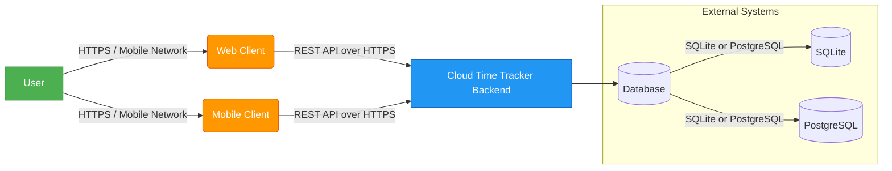
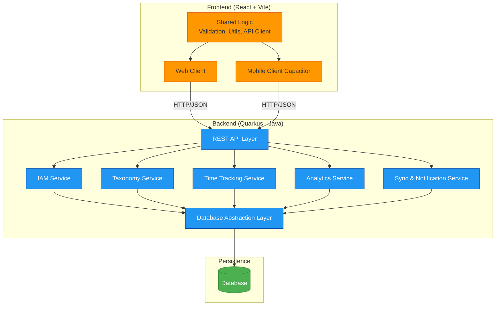
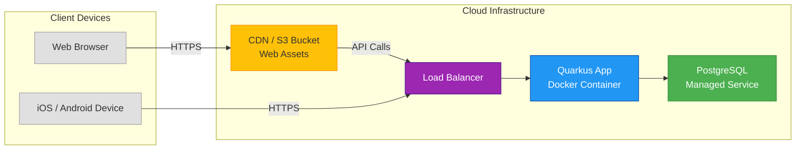
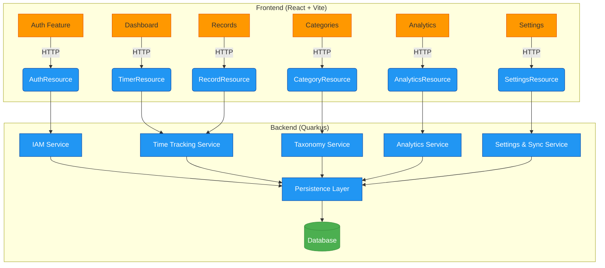

## **Technical Architecture and Design Document – Chapter Summary**

### **Chapter 1: Introduction**

- **Purpose**: Define the scope, goals, and audience of the architecture document.  
- **System Context**: Position the Cloud Time Tracker within the broader ecosystem (users, devices, cloud infrastructure).  
- **Document Conventions**: Notation (UML, C4 model), terminology, versioning.  
- **References**: Link to FRD, style guides, Quarkus/React documentation.

---

### **Chapter 2: Architectural Overview**

- **Architectural Style**: Client–Server with RESTful API; stateless backend.  
- **High-Level Component Diagram**:  
  - **Frontend Layer**: Shared React+Vite codebase → compiled to Web (SPA) and Mobile (via Capacitor or React Native).  
  - **Backend Layer**: Quarkus (Java) microservice exposing REST APIs.  
  - **Persistence Layer**: Abstracted data access supporting both **SQLite** (for local/dev/offline) and **PostgreSQL** (cloud production).  
- **Deployment View**: Cloud-hosted (e.g., AWS ECS/EKS or bare VM), CDN for static assets, database hosted separately.

---

### **Chapter 3: Technology Stack & Constraints**

- **Frontend**:  
  - Framework: **React \+ Vite**  
  - Cross-platform strategy: **Capacitor** (preferred for shared codebase) or **React Native** (if native performance needed).  
  - State management: Zustand/Jotai (lightweight, SSR-friendly).  
- **Backend**:  
  - Runtime: **Quarkus** (GraalVM native support optional)  
  - Language: **Java 17+**  
  - Build: Maven  
- **Database Abstraction**:  
  - Use **Hibernate ORM with dialect switching** or **MyBatis** for SQL portability.  
  - Configuration-driven DB selection (`quarkus.datasource.db-kind=postgresql` or `sqlite`).  
- **Authentication**: JWT \+ Refresh tokens (stateless sessions).  
- **Build & CI/CD**: GitHub Actions / GitLab CI; Docker images for backend; Vite builds for frontend.

---

### **Chapter 4: System Decomposition (Modules & Components)**

Map each FRD module to technical components:

- **IAM Service**: AuthController, UserService, RBAC middleware.  
- **Taxonomy Service**: CategoryService, TagService, GoalEngine.  
- **TimeTracking Core**: TimerService, RecordService, ConflictResolver.  
- **Analytics Engine**: AggregationService, ChartDataGenerator.  
- **Sync & Notification Manager**: WebSocket or polling-based sync layer; Push notification adapter (Firebase for mobile, Browser API for web).

Each component includes:

- Responsibilities  
- Input/Output contracts  
- Dependencies

---

### **Chapter 5: Data Architecture**

- **Logical Data Model**: ER diagram based on FRD Chapter 10 (User, Category, Tag, TimeRecord, RunningTimer).  
- **Physical Schema per DB**:  
  - **PostgreSQL**: Optimized for concurrency, indexing on `user_id`, `start_timestamp`.  
  - **SQLite**: Embedded mode; same schema but relaxed constraints (e.g., no native UUID).  
- **Multi-Tenancy Strategy**: Row-level isolation via `user_id` in every query (no shared schemas).  
- **UTC Everywhere**: All timestamps stored in UTC; timezone conversion in frontend.  
- **Migration Strategy**: Flyway or Liquibase with conditional scripts per DB type.

---

### **Chapter 6: API Specification**

- **RESTful Contract** (OpenAPI 3.0):  
  - `/auth/login`, `/users/me`, `/categories`, `/records`, `/records/export`  
- **Request/Response Examples**: JSON payloads matching FRD data formats.  
- **Error Handling**: Standardized error responses (code, message, field).  
- **Security**: JWT in `Authorization: Bearer <token>`; rate limiting.

---

### **Chapter 7: Cross-Platform Strategy (Web \+ Mobile)**

- **Code Sharing Approach**:  
  - Shared logic (business rules, validation, API clients) in a **common TypeScript package**.  
  - Platform-specific UI wrappers (e.g., `<TimerButton />` renders native button on mobile, HTML button on web).  
- **State Sync Mechanism**:  
  - **Real-time**: Optional WebSocket for timer sync; fallback to polling (every 5s).  
  - **Offline Support (Mobile)**: Local SQLite queue → background sync on connectivity restore.  
- **UI Consistency**: Shared design system (CSS variables, icon library, theme context).

---

### **Chapter 8: Non-Functional Design**

- **Security**:  
  - HTTPS enforced  
  - Argon2/Bcrypt password hashing  
  - Input sanitization (Quarkus built-in protections)  
- **Performance**:  
  - Pagination for record lists  
  - Caching (Redis optional for MVP)  
  - Lazy loading of charts  
- **Scalability**:  
  - Stateless Quarkus app → easy horizontal scaling  
  - Connection pooling per DB  
- **Reliability**:  
  - Idempotent APIs for safe retries  
  - Transactional boundaries for record edits  
- **Compliance**:  
  - GDPR-ready data deletion hooks  
  - Audit log for admin actions (optional in MVP)

---

### **Chapter 9: Deployment & Operations**

- **Environments**: Dev, Staging, Prod  
- **Infrastructure as Code**: Terraform or Pulumi (optional)  
- **Monitoring**: Health endpoints (`/q/health`), logging (structured JSON logs)  
- **Backup & Recovery**: Daily DB snapshots; point-in-time recovery for PostgreSQL

---

### **Chapter 10: Risks & Open Issues**

- **Technical Risks**:  
  - SQLite vs PostgreSQL SQL dialect differences (mitigation: ORM abstraction, integration tests per DB).  
  - Real-time sync complexity (mitigation: start with polling, add WebSocket later).  
- **Open Decisions**:  
  - Capacitor vs React Native?  
  - WebSocket or Server-Sent Events (SSE) for sync?  
  - On-device encryption for mobile SQLite?

---

 Certainly\! Below is **Chapter 1: Introduction** of your **Technical Architecture and Design Document (TADD)**, crafted to align precisely with your functional requirements, technical constraints (shared React+Vite frontend for Web & Mobile, Quarkus/Java backend, multi-database support for SQLite and PostgreSQL), and industry best practices.

---

# **Chapter 1: Introduction**

## **1.1 Purpose**

This Technical Architecture and Design Document (TADD) defines the structural blueprint, component interactions, data flows, and technology decisions for the **Cloud Time Tracker** system. It serves as the authoritative technical reference for developers, DevOps engineers, QA testers, and system architects involved in implementing the solution described in the Functional Requirements Document (FRD).

The primary objectives of this document are to:

- Specify a unified architecture that supports **both Web and Mobile clients from a single shared codebase**.  
- Define a **Quarkus-based Java backend** capable of operating with **multiple relational database engines** (SQLite for local/embedded scenarios, PostgreSQL for cloud production).  
- Ensure secure, scalable, and maintainable implementation of all functional modules (IAM, Taxonomy, Time Tracking, Analytics, Settings).  
- Establish clear boundaries, interfaces, and non-functional behaviors (security, performance, sync logic) required for a robust cloud-native time-tracking platform.

## **1.2 Scope**

This document covers the end-to-end technical design of the Cloud Time Tracker system, including:

### **In Scope**

- **Frontend Architecture**: Shared React \+ Vite codebase structured for reuse across Web (SPA) and Mobile (via Capacitor or equivalent hybrid runtime).  
- **Backend Architecture**: RESTful API layer implemented in **Quarkus (Java 17+)** with modular service decomposition.  
- **Persistence Layer**: Abstracted data access supporting both **SQLite** (for development, testing, or offline-capable mobile use) and **PostgreSQL** (for cloud deployment), with dialect-aware schema management.  
- **Authentication & Authorization**: JWT-based stateless sessions with RBAC enforcement.  
- **Cross-Platform Synchronization**: Real-time and conflict-resilient data consistency between Web and Mobile clients.  
- **Deployment Model**: Containerized (Docker) backend services deployable to cloud infrastructure (e.g., AWS, Azure).

### **Out of Scope**

- Native mobile development (Kotlin/Swift) — the mobile app will be built from the shared web codebase.  
- Desktop application packaging (e.g., Electron, Tauri) — desktop users are served via the responsive Web App.  
- Advanced analytics (e.g., machine learning insights) — limited to FRD-defined charts and filters.  
- Multi-region or multi-cloud failover architectures (MVP assumes single-region deployment).

## **1.3 Definitions, Acronyms, and Abbreviations**

| Term | Definition |
| :---- | :---- |
| **TADD** | Technical Architecture and Design Document |
| **FRD** | Functional Requirements Document |
| **Quarkus** | A Kubernetes-native Java framework optimized for GraalVM and OpenJDK HotSpot |
| **Capacitor** | Cross-platform native runtime for deploying web apps to iOS and Android |
| **RBAC** | Role-Based Access Control |
| **JWT** | JSON Web Token — used for authentication and session management |
| **ORM** | Object-Relational Mapping — e.g., Hibernate ORM in Quarkus |
| **UTC** | Coordinated Universal Time — the standard time format for all persisted timestamps |
| **MVP** | Minimum Viable Product — the initial release scope defined in the FRD |
| **CRUD** | Create, Read, Update, Delete — basic data operations |

## **1.4 Document Structure Overview**

The remainder of this document is organized as follows:

- **Chapter 2: Architectural Overview** – High-level system context, C4 model diagrams, and deployment topology.  
- **Chapter 3: Technology Stack & Constraints** – Detailed justification of chosen frameworks, libraries, and architectural patterns.  
- **Chapter 4: System Decomposition** – Modular breakdown of backend services and frontend feature domains.  
- **Chapter 5: Data Architecture** – Logical and physical data models, multi-database strategy, and migration approach.  
- **Chapter 6: API Specification** – REST contract, error handling, and security policies.  
- **Chapter 7: Cross-Platform Strategy** – Code sharing, UI adaptation, and sync mechanics for Web \+ Mobile.  
- **Chapter 8: Non-Functional Design** – Security, performance, scalability, and compliance controls.  
- **Chapter 9: Deployment & Operations** – CI/CD pipeline, monitoring, logging, and recovery procedures.  
- **Chapter 10: Risks & Open Issues** – Known technical challenges and mitigation strategies.

This structure ensures traceability from business requirements (FRD) to technical implementation while adhering to the project’s core constraint: **a single codebase powering both Web and Mobile experiences, backed by a flexible, multi-database Quarkus backend**.

---

 

# **Chapter 2: Architectural Overview**

## **2.1 System Context**

The **Cloud Time Tracker** is a cloud-native, cross-platform application that enables users to track, categorize, and analyze time usage across **Web** and **Mobile** clients. Unlike the original local-only Android app, this system relies on a centralized backend to provide authentication, data synchronization, and multi-device consistency.

The system operates under a **client–server model**, where:

- **Clients** (Web and Mobile) consume RESTful APIs.  
- The **Backend** enforces business logic, RBAC, and data isolation.  
- **Persistence** is abstracted to support both **SQLite** (for development, testing, or offline-capable mobile scenarios) and **PostgreSQL** (for production cloud deployments).

### **System Context Diagram (C4 Model – Level 1\)**

**Note**: The database engine is selected at runtime via configuration—only one is active per deployment.

---

## **2.2 High-Level Component Architecture**

The system is decomposed into three logical layers:

### **1\. Frontend Layer (Shared Codebase)**

- Built with **React \+ Vite**.  
- Shared business logic (e.g., validation, time calculations) resides in a `shared/` directory.  
- Platform-specific UI adapters:  
  - **Web**: Standard React SPA served via CDN or static hosting.  
  - **Mobile**: Wrapped with **Capacitor** to deploy as native iOS/Android apps.  
- State management uses a lightweight solution (e.g., Zustand) to avoid framework lock-in.

### **2\. Backend Layer (Quarkus Microservice)**

- Single **Quarkus** application exposing REST endpoints.  
- Modular internal structure:  
  - `iam/`: Authentication, registration, RBAC  
  - `taxonomy/`: Categories, tags, goals  
  - `tracking/`: Timer logic, record CRUD  
  - `analytics/`: Aggregation, chart data  
  - `sync/`: Conflict resolution, real-time updates  
- Stateless design with JWT-based authentication.  
- Database access abstracted via **Hibernate ORM** with dialect switching.

### **3\. Persistence Layer**

- **Single logical schema** mapped to two physical implementations:  
  - **PostgreSQL**: Used in cloud environments; supports JSONB, robust concurrency.  
  - **SQLite**: Used for local testing or embedded mobile use (via Capacitor SQLite plugin).  
- Schema migrations managed by **Flyway**, with conditional scripts per DB type.

### **Component Diagram (C4 Model – Level 2\)**


---

## **2.3 Deployment View**

The system is designed for **cloud deployment** with containerization support:

- **Backend**: Packaged as a Docker image (Quarkus fast-jar or native binary).  
- **Frontend**:  
  - Web: Static assets built by Vite → served via CDN or Nginx.  
  - Mobile: Capacitor bundles the same Vite output into native wrappers.  
- **Database**:  
  - **Production**: Managed PostgreSQL (e.g., AWS RDS, Azure Database).  
  - **Development/Testing**: Embedded SQLite or local PostgreSQL.

### **Deployment Diagram**



**Note**: For local development or offline mobile use, the Quarkus backend can be configured to use **SQLite**, and the mobile app can sync later when online.

---

## **2.4 Key Architectural Decisions**

| Decision | Rationale |
| :---- | :---- |
| **Shared React \+ Vite codebase** | Maximizes reuse between Web and Mobile; reduces maintenance cost. Capacitor enables near-native mobile experience without duplicating logic. |
| **Quarkus (Java) backend** | Fast startup, low memory footprint, excellent Hibernate support, and strong ecosystem for cloud-native apps. |
| **Multi-database via Hibernate dialects** | Allows single codebase to support SQLite (for dev/offline) and PostgreSQL (for prod) with minimal branching. |
| **Stateless JWT sessions** | Simplifies scaling; no server-side session storage required. |
| **"Last Write Wins" conflict resolution** | Simple, predictable behavior for MVP; sufficient for single-user multi-device sync. |

---

# **Chapter 3: Technology Stack & Constraints**

## **3.1 Overview**

This chapter details the selected technologies, frameworks, and architectural patterns that will be used to implement the **Cloud Time Tracker** system. Every choice is driven by the functional and non-functional requirements defined in the FRD, with special emphasis on three core project constraints:

1. **A single shared codebase must power both Web and Mobile clients.**  
2. **The backend must be implemented in Java using Quarkus.**  
3. **The persistence layer must support both SQLite (for local/offline use) and PostgreSQL (for cloud production).**

The stack prioritizes **developer productivity**, **runtime performance**, **security**, and **long-term maintainability**.

---

## **3.2 Frontend Stack**

### **3.2.1 Core Framework: React \+ Vite**

- **Why React?**  
    
  - Component-based architecture enables maximal reuse between Web and Mobile UIs.  
  - Large ecosystem, strong TypeScript support, and mature state management options.  
  - Matches FRD’s need for dynamic charts (Pie/Bar/Timeline) via libraries like Chart.js or Recharts.


- **Why Vite?**  
    
  - Blazing-fast development server and near-instant HMR (Hot Module Replacement).  
  - Optimized production builds with native ES modules → improves **NFR-PERF-02** (Web load \<1.5s).  
  - Built-in support for TypeScript, CSS modules, and asset handling.

✅ **FRD Alignment**: Enables responsive dashboard (FR-ANA-01), fast chart rendering (FR-ANA-02), and WCAG-compliant UI (NFR-USE-02).

### **3.2.2 Cross-Platform Strategy: Capacitor**

- **Technology**: [Capacitor](https://capacitorjs.com/) by Ionic  
- **Rationale**:  
  - Allows the **same Vite-built React app** to run as a native iOS/Android app.  
  - Provides access to native device features (e.g., local notifications, background sync) without ejecting from the web stack.  
  - Supports **offline-first SQLite storage** on mobile via `@capacitor-community/sqlite`.  
- **Alternative Considered**: React Native — rejected due to inability to share 100% of logic/UI with Web SPA.

✅ **FRD Alignment**: Satisfies **FR-SET-03.3** (offline mobile timer support) and **FR-CORE-05.1** (cross-device sync).

### **3.2.3 State Management: Zustand**

- **Why Zustand?**  
  - Minimalist, hooks-based, zero-boilerplate state management.  
  - No context providers → avoids re-render waterfall.  
  - Serializable store → supports persistence (e.g., “Remember Me” settings).  
- **Used For**: Auth state, active timer, theme preference, sync status.

✅ **FRD Alignment**: Supports **FR-SET-01.1** (theme persistence) and real-time timer state (**FR-CORE-01.2**).

### **3.2.4 Styling & Theming**

- **CSS Modules \+ CSS Variables**: Scoped styles with dynamic theming.  
- **Dark/Light Mode**: Controlled via `prefers-color-scheme` media query \+ user override (**FR-SET-01.1**).  
- **Responsive Grid**: Tailwind CSS (optional) or custom flex/grid for mobile-first layouts.

---

## **3.3 Backend Stack**

### **3.3.1 Runtime: Quarkus (Java 17+)**

- **Why Quarkus?**  
  - **Cloud-native by design**: Fast startup (\<100ms), low memory footprint — ideal for containers and serverless.  
  - **Hibernate ORM \+ Panache**: Simplifies JPA usage while supporting multiple dialects (PostgreSQL, SQLite).  
  - **Built-in security**: JWT validation, RBAC annotations (`@RolesAllowed`), CSRF protection.  
  - **Reactive & imperative support**: RESTEasy Reactive for high-throughput APIs.  
- **Build Tool**: Maven (standard in Quarkus ecosystem).

✅ **FRD Alignment**: Enforces **RBAC** (FR-IAM-04), JWT auth (FR-IAM-02), and scalable API (NFR-SCALE-01).

### **3.3.2 Authentication & Session**

- **JWT (Stateless)**: Issued on login; validated on each request.  
- **Refresh Tokens**: Stored securely:  
  - **Web**: `HttpOnly`, `Secure`, `SameSite=Strict` cookies.  
  - **Mobile**: Encrypted in platform KeyStore (Android) / Keychain (iOS) via Capacitor plugin.  
- **Token Rotation**: On password change (**FR-IAM-06.3**), all refresh tokens are invalidated.

✅ **FRD Alignment**: Meets **NFR-SEC-04** (secure token handling) and **FR-IAM-02.4** (“Remember Me”).

### **3.3.3 API Layer**

- **Protocol**: REST over HTTPS (GraphQL considered but rejected for MVP simplicity).  
- **Serialization**: JSON-B (built into Quarkus) or Jackson.  
- **Validation**: Bean Validation (`@Valid`) \+ custom constraints (e.g., `End > Start` for records).  
- **Error Handling**: Standardized JSON error responses with HTTP status codes (**DATA-API-03**).

---

## **3.4 Persistence Layer**

### **3.4.1 Multi-Database Strategy**

| Requirement | Solution |
| :---- | :---- |
| Support **SQLite** (mobile/local) and **PostgreSQL** (cloud) | Use **Hibernate ORM** with runtime dialect switching |
| Single logical schema | Define entities once; let Hibernate adapt SQL per dialect |
| Schema migrations | **Flyway** with conditional scripts (`V1__init_postgresql.sql`, `V1__init_sqlite.sql`) |

#### **Key Configuration**

\# quarkus.properties

%prod.quarkus.datasource.db-kind=postgresql

%prod.quarkus.datasource.jdbc.url=jdbc:postgresql://db:5432/timetracker

%dev.quarkus.datasource.db-kind=sqlite

%dev.quarkus.datasource.jdbc.url=jdbc:sqlite:./timetracker.db

✅ **FRD Alignment**: Enables **FR-SET-03.3** (offline mobile with SQLite) and **NFR-SCALE-03** (PostgreSQL indexing for large datasets).

### **3.4.2 Data Model Mapping**

- **Entities**: `User`, `Category`, `Tag`, `TimeRecord`, `RunningTimer`  
- **Multi-tenancy**: Every query includes `WHERE user_id = :currentUserId` (enforced via Hibernate `@Filter` or service-layer logic).  
- **UTC Timestamps**: All `LocalDateTime` fields stored as `Instant` in UTC (**DATA-INT-02**).

### **3.4.3 Conflict Resolution**

- **"Last Write Wins"**: Implemented via `updated_at` timestamp column.  
- On sync, client sends `last_modified` → server accepts update only if newer.

✅ **FRD Alignment**: Directly implements **FR-SET-03.2**.

---

## **3.5 Build, Test & Deployment**

| Concern | Technology |
| :---- | :---- |
| **Frontend Build** | Vite (ESBuild \+ Rollup) |
| **Mobile Packaging** | Capacitor CLI → Xcode / Android Studio |
| **Backend Build** | Maven \+ Quarkus Dev UI |
| **Containerization** | Docker (multi-stage for frontend/backend) |
| **CI/CD** | GitHub Actions (run tests, build images, deploy to staging) |
| **Testing** |  |

- Frontend: Vitest \+ React Testing Library  
- Backend: JUnit 5 \+ REST Assured  
- E2E: Cypress (Web), Detox (Mobile via Capacitor) |

---

## **3.6 Key Constraints Summary**

| Constraint | Implementation |
| :---- | :---- |
| **Single codebase for Web & Mobile** | React \+ Vite \+ Capacitor |
| **Quarkus (Java) backend** | RESTEasy Reactive \+ Hibernate ORM |
| **SQLite \+ PostgreSQL support** | Hibernate dialect \+ Flyway conditional migrations |
| **GDPR compliance** | Hard delete cascade (**FR-IAM-05.1**), data export (**FR-SET-04.1**) |
| **Offline mobile support** | Capacitor SQLite \+ sync queue |
| **Real-time sync** | Polling (MVP); WebSocket upgrade path |

---

 

# **Chapter 4: System Decomposition**

## **4.1 Overview**

This chapter decomposes the Cloud Time Tracker system into cohesive, loosely coupled **modules** and **components**, each responsible for a specific functional area defined in the FRD. The decomposition follows the **modular monolith** pattern within Quarkus—ideal for an MVP—while ensuring clear separation of concerns, testability, and future scalability (e.g., microservices extraction).

The system is divided into:

- **Frontend Feature Modules** (shared across Web and Mobile)  
- **Backend Service Modules** (Quarkus Java packages)

Each component includes:

- **Responsibilities**  
- **Key interfaces or APIs**  
- **Dependencies**  
- **Traceability to FRD**

---

## **4.2 Frontend Module Decomposition**

The frontend is structured as a **monorepo-style** React application with shared logic and platform-adaptive UIs.

### **4.2.1 Shared Core (`/src/shared`)**

- **Purpose**: Business logic, utilities, and API clients reused by Web and Mobile.  
- **Contents**:  
  - `api/`: Axios-based HTTP client with interceptors (auth, error handling)  
  - `utils/`: Time formatting, validation, conflict resolution helpers  
  - `types/`: TypeScript interfaces matching backend DTOs  
  - `store/`: Zustand stores (auth, timer, settings)  
- **FRD Traceability**: Supports **FR-CORE-01–05**, **FR-IAM-01–06**, **FR-SET-01–04**

### **4.2.2 Feature Modules (`/src/features`)**

| Module | Responsibility | FRD Coverage |
| :---- | :---- | :---- |
| `auth` | Login, registration, password reset | FR-IAM-01, FR-IAM-02, FR-IAM-06 |
| `dashboard` | Home view with active timer, today’s summary | FR-CORE-01.1, FR-ANA-01 |
| `records` | List, edit, split, merge time records | FR-CORE-03, FR-CORE-04 |
| `categories` | CRUD for categories (color, icon, name) | FR-TAX-01 |
| `tags` | Tag management and filtering | FR-TAX-02 |
| `goals` | Goal definition and progress tracking | FR-TAX-03 |
| `analytics` | Charts (pie/bar/line), timeline view | FR-ANA-02, FR-ANA-03 |
| `settings` | Theme, timezone, notifications, export/delete | FR-SET-01, FR-SET-04 |
| `sync` | Offline queue, sync status indicator | FR-SET-03.2, FR-SET-03.3 |

✅ **Cross-Platform Note**: Each feature uses **adaptive components** (e.g., `<Button />` renders native button on mobile via Capacitor, HTML button on web).

---

## **4.3 Backend Service Decomposition (Quarkus Modules)**

The backend is organized into **Java packages** under `com.timetracker`, each representing a bounded context.

### **4.3.1 IAM Service (`iam/`)**

- **Responsibilities**:  
  - User registration, login, password reset  
  - JWT issuance and validation  
  - Role-based access control (Standard User, Admin)  
  - Account deletion (GDPR-compliant cascade)  
- **Key Classes**:  
  - `AuthResource` (REST endpoints)  
  - `UserService`, `PasswordService`  
  - `JwtGenerator`, `JwtValidator`  
- **Dependencies**: `security/`, `persistence/`  
- **FRD Traceability**: FR-IAM-01 to FR-IAM-06

### **4.3.2 Taxonomy Service (`taxonomy/`)**

- **Responsibilities**:  
  - Manage user-defined categories (name, color, icon)  
  - Tag creation and assignment  
  - Goal definition (target hours, category association)  
- **Key Classes**:  
  - `CategoryResource`, `TagResource`, `GoalResource`  
  - `CategoryService`, `TagService`, `GoalEngine`  
- **Dependencies**: `persistence/`, `iam/` (for user isolation)  
- **FRD Traceability**: FR-TAX-01 to FR-TAX-03

### **4.3.3 Time Tracking Service (`tracking/`)**

- **Responsibilities**:  
  - Start/stop/pause/resume timers  
  - Create/edit manual time records  
  - Enforce “one active timer per user” rule  
  - Handle record splitting/merging  
- **Key Classes**:  
  - `TimerResource`, `RecordResource`  
  - `TimerService`, `RecordService`, `ConflictResolver`  
- **Dependencies**: `persistence/`, `iam/`, `taxonomy/` (for category/tag validation)  
- **FRD Traceability**: FR-CORE-01 to FR-CORE-05

### **4.3.4 Analytics Service (`analytics/`)**

- **Responsibilities**:  
  - Aggregate time by category, tag, date range  
  - Generate chart data (daily, weekly, monthly)  
  - Provide timeline view data  
- **Key Classes**:  
  - `AnalyticsResource`  
  - `AggregationService`, `ChartDataGenerator`  
- **Dependencies**: `persistence/`, `iam/`  
- **FRD Traceability**: FR-ANA-01 to FR-ANA-03

### **4.3.5 Settings & Sync Service (`settings/`)**

- **Responsibilities**:  
  - Manage user preferences (theme, start-of-week, notifications)  
  - Export data as CSV  
  - Initiate account deletion  
  - Coordinate offline-to-online sync (via timestamp-based conflict resolution)  
- **Key Classes**:  
  - `SettingsResource`, `ExportService`, `SyncCoordinator`  
- **Dependencies**: `persistence/`, `iam/`, `tracking/`  
- **FRD Traceability**: FR-SET-01 to FR-SET-04

### **4.3.6 Persistence Layer (`persistence/`)**

- **Responsibilities**:  
  - Abstract database access  
  - Enforce row-level security (`user_id` filter)  
  - Handle dialect-specific queries (PostgreSQL vs SQLite)  
- **Key Classes**:  
  - JPA Entities: `User`, `Category`, `TimeRecord`, etc.  
  - Repositories: `TimeRecordRepository`, `CategoryRepository`  
  - `DatabaseConfig` (dialect selection)  
- **Dependencies**: None (lowest layer)  
- **FRD Traceability**: All data-related requirements

### **4.3.7 Security & Infrastructure (`infra/`)**

- **Responsibilities**:  
  - Logging, health checks, metrics  
  - CORS, rate limiting  
  - Email/SMS notification adapters (stubbed for MVP)  
- **Key Classes**:  
  - `HealthResource`, `LoggingFilter`, `CorsConfig`  
- **Dependencies**: None

---

## **4.4 Component Interaction Diagram**

 

**Note**: All service calls are synchronous REST over HTTPS. Async operations (e.g., email) will use Quarkus `@Blocking` or reactive messaging in future phases.

---

## **4.5 Cross-Cutting Concerns**

| Concern | Implementation |
| :---- | :---- |
| **Authentication** | JWT verified via `@RolesAllowed` \+ custom `SecurityIdentity` |
| **Data Isolation** | Every repository method filters by `currentUserId()` |
| **Validation** | Bean Validation (`@NotNull`, `@Future`, custom `@ValidTimeRange`) |
| **Error Handling** | Global exception mapper → standardized JSON errors |
| **Logging** | Structured JSON logs with request ID tracing |
| **Testing** | Each service has unit tests (Mockito) and integration tests (Quarkus @QuarkusTest) |

---

## **4.6 Traceability Matrix (Sample)**

| FRD ID | Component(s) | Verification Method |
| :---- | :---- | :---- |
| FR-CORE-01.1 | `TimerService`, `TimerResource` | Unit test \+ Postman |
| FR-IAM-05.1 | `UserService.deleteAccount()` | Integration test (cascade delete) |
| FR-SET-03.2 | `SyncCoordinator`, `RecordService` | E2E test (offline → online sync) |
| FR-ANA-02 | `AggregationService` | Snapshot test (chart data output) |

---

# **Chapter 5: Data Architecture**

## **5.1 Overview**

This chapter defines the logical and physical data models for the **Cloud Time Tracker** system. The architecture supports two deployment modes:

- **Cloud Mode**: Uses **PostgreSQL** for production-grade scalability, concurrency, and reliability.  
- **Local/Offline Mode**: Uses **SQLite** for development, testing, or mobile offline scenarios (via Capacitor).

Despite differing engines, the system maintains a **single logical schema** to ensure code consistency. All data is strictly **user-scoped** to enforce multi-tenancy at the row level, as required by **FR-IAM-04** and **NFR-SEC-03**.

The design prioritizes:

- **Data integrity** (via constraints and cascades)  
- **Query performance** (via indexing and UTC-normalized timestamps)  
- **GDPR compliance** (via hard-delete on account removal)

---

## **5.2 Logical Data Model**

The conceptual entities from **FRD Chapter 10** are formalized into a normalized relational model. Each entity includes attributes, relationships, and cardinality.

### **Entity Relationship Diagram (ERD – Logical View)**
```mermaid
erDiagram

    USER ||--o{ CATEGORY : owns

    USER ||--o{ TAG : owns

    USER ||--o{ TIME_RECORD : owns

    USER ||--o{ RUNNING_TIMER : owns

    CATEGORY {

        UUID category_id PK

        UUID user_id FK

        string name

        string hex_color

        string icon_id

        boolean is_archived

    }

    TAG {

        UUID tag_id PK

        UUID user_id FK

        string name

    }

    TIME_RECORD {

        UUID record_id PK

        UUID user_id FK

        UUID category_id FK

        timestamp start_timestamp

        timestamp end_timestamp

        bigint duration_seconds

        text note

    }

    RECORD_TAG {

        UUID record_id FK

        UUID tag_id FK

    }

    RUNNING_TIMER {

        UUID timer_id PK

        UUID user_id FK

        UUID category_id FK

        timestamp start_timestamp

    }

    USER {

        UUID user_id PK

        string email

        string password_hash

        string role

        jsonb settings

        timestamp created_at

        timestamp last_login

```
 

**Note**:

- `UUID` is used for all primary keys to avoid sequential ID leakage and simplify sync logic.  
- `settings` is stored as `JSONB` (PostgreSQL) or `TEXT` (SQLite) to support dynamic preferences (**FR-SET-01**).  
- `RECORD_TAG` implements the many-to-many relationship between records and tags (**FR-TAX-02.3**).

---

## **5.3 Physical Schema per Database**

While the logical model is unified, physical implementation adapts to each database’s capabilities.

### **5.3.1 PostgreSQL (Cloud Production)**

| Feature | Implementation |
| :---- | :---- |
| **Primary Keys** | `UUID` with `gen_random_uuid()` default |
| **Timestamps** | `TIMESTAMP WITH TIME ZONE` (stored in UTC) |
| **User Settings** | `JSONB` column for efficient querying and indexing |
| **Indexing** |  |

- `(user_id, start_timestamp)` on `time_record` → fast date-range queries (**FR-ANA-03.1**)  
- `(user_id, email)` unique index on `user` → enforce **FR-IAM-01.5**  
- GIN index on `settings` if needed for future feature expansion | | **Constraints** | Foreign keys with `ON DELETE CASCADE` for user deletion (**FR-IAM-05.1**) |

### **5.3.2 SQLite (Local/Offline Mobile)**

| Feature | Implementation |
| :---- | :---- |
| **Primary Keys** | `TEXT` (UUID as string) |
| **Timestamps** | `TEXT` in ISO 8601 format (`YYYY-MM-DD HH:MM:SS.SSSZ`) |
| **User Settings** | `TEXT` (serialized JSON) |
| **Indexing** | Same logical indexes as PostgreSQL, but limited to B-tree |
| **Constraints** | Foreign key enforcement enabled via `PRAGMA foreign_keys = ON` |

✅ **FRD Alignment**: Enables **FR-SET-03.3** (offline mobile with local SQLite) while maintaining API compatibility.

---

## **5.4 Multi-Tenancy Strategy**

The system uses **row-level isolation**—not separate schemas or databases—to keep costs low and simplify operations.

- Every table (except `user`) has a `user_id` column.  
- All service-layer queries **must** include `WHERE user_id = :currentUserId`.  
- Enforced via:  
  - **Hibernate `@Filter`** (applied globally in Quarkus)  
  - **Manual validation** in repositories as a safety net

⚠️ **Security Note**: This satisfies **NFR-SEC-03** (“queries must always include `WHERE user_id = X`”).

---

## **5.5 Data Lifecycle & Integrity Rules**

### **5.5.1 Referential Integrity**

| Action | Behavior |
| :---- | :---- |
| **Delete User** | Cascade delete all `Category`, `Tag`, `TimeRecord`, `RunningTimer` (**FR-IAM-05.1**, **DATA-INT-01**) |
| **Delete Category** | Block unless user chooses to: |
| a) Delete all associated records, or |  |
| b) Reassign to “Uncategorized” (**FR-TAX-01.4**) |  |
| **Delete Tag** | Orphaned tags are removed; no cascade to records (tags are soft-referenced) |

### **5.5.2 Timestamp Handling**

- All timestamps are **stored in UTC** (**DATA-INT-02**).  
- Conversion to local time occurs **only in the frontend** using the user’s timezone setting (**FR-SET-01.2**).  
- Example: A record from 9 AM EST is stored as `2026-01-24T14:00:00Z`.

### **5.5.3 Duration Calculation**

- `duration_seconds` is **derived** from `end_timestamp - start_timestamp`.  
- Updated automatically on record edit (**FR-CORE-03.1**).  
- Prevents client-side tampering.

---

## **5.6 Migration Strategy**

Schema evolution is managed by **Flyway**, with conditional scripts per database.

### **Directory Structure**

src/main/resources/db/

├── migration/

│   ├── V1\_\_init\_postgresql.sql

│   └── V1\_\_init\_sqlite.sql

└── conf/

    ├── postgresql.conf

    └── sqlite.conf

### **Quarkus Configuration**

\# Enable Flyway

quarkus.flyway.migrate-at-start=true

\# PostgreSQL (prod)

%prod.quarkus.datasource.db-kind=postgresql

%prod.quarkus.flyway.locations=db/migration/postgresql

\# SQLite (dev/mobile)

%dev.quarkus.datasource.db-kind=sqlite

%dev.quarkus.flyway.locations=db/migration/sqlite

✅ **Benefit**: Ensures both databases stay in sync with business logic changes.

---

## **5.7 Data Export & GDPR Compliance**

### **CSV Export (FR-CORE-04)**

- Backend generates CSV from `time_record` with joined `category.name` and `tag.name`.  
- Includes only current user’s data.  
- Respects date filters (**FR-CORE-04.2**).

### **Full Data Export (FR-SET-04.1)**

- Exports all user data as **JSON** (for portability):  
    
  {  
    
    "categories": \[...\],  
    
    "tags": \[...\],  
    
    "records": \[...\],  
    
    "settings": {...}  
    
  }  
    
- Used for GDPR “Right to Access”.

### **Account Deletion (FR-IAM-05.1)**

- Implemented as a **hard delete** with cascade.  
- Verified via integration test that no orphaned records remain.

---

## **5.8 Indexing Strategy**

| Table | Index | Purpose |
| :---- | :---- | :---- |
| `time_record` | `(user_id, start_timestamp DESC)` | Fast dashboard loading (**FR-ANA-01.3**) |
| `time_record` | `(user_id, category_id, start_timestamp)` | Category-based analytics (**FR-ANA-02.1**) |
| `user` | `(email)` UNIQUE | Enforce unique registration (**FR-IAM-01.5**) |
| `running_timer` | `(user_id)` UNIQUE | Enforce single active timer (**FR-CORE-01.3**) |

✅ Supports **NFR-PERF-01** (API \<200ms) even with 10k+ records.

---

 

# **Chapter 6: API Specification**

## **6.1 Overview**

This chapter defines the **RESTful API contract** between the Cloud Time Tracker frontend clients (Web and Mobile) and the Quarkus backend. The API follows a **resource-oriented**, **stateless**, and **secure** design, using **JSON over HTTPS** for all communication.

Key design principles:

- **Idempotency**: Safe retry of requests (e.g., `POST /records` includes client-generated ID).  
- **Consistent Error Format**: All errors return structured JSON.  
- **RBAC Enforcement**: Every endpoint validates user role and ownership.  
- **UTC Timestamps**: All date/time values use ISO 8601 in UTC (`2026-01-24T15:30:00Z`).  
- **Pagination**: For large collections (e.g., records), to meet **NFR-PERF-01**.

The API is versioned via path prefix: `/api/v1`.

---

## **6.2 Authentication & Authorization**

### **6.2.1 Token Flow**

1. Client sends credentials to `POST /api/v1/auth/login`.  
2. Server responds with:  
     
   {  
     
     "access\_token": "eyJhbGciOiJIUzI1NiIsInR5cCI6IkpXVCJ9.xxxxx",  
     
     "refresh\_token": "def50200a1b2c3d4...",  
     
     "expires\_in": 900  
     
   }  
     
3. Client includes `Authorization: Bearer <access_token>` in all subsequent requests.  
4. On `401`, client uses `refresh_token` at `POST /api/v1/auth/refresh` to get a new `access_token`.

### **6.2.2 Role-Based Access Control (RBAC)**

- **Standard User**: Can access only their own data (`user_id` matches JWT subject).  
- **Administrator**: Can access `/admin/*` endpoints (e.g., user list).  
- Enforced via Quarkus `@RolesAllowed` and custom `@UserScoped` interceptor.

---

## **6.3 API Endpoints (OpenAPI Summary)**

Full OpenAPI 3.0 spec can be auto-generated by Quarkus (`/q/openapi`).

### **6.3.1 Identity & Access Management (IAM)**

| Endpoint | Method | Description | RBAC | FRD Trace |
| :---- | :---- | :---- | :---- | :---- |
| `/auth/register` | `POST` | Create new Standard User | Guest | FR-IAM-01 |
| `/auth/login` | `POST` | Authenticate & issue tokens | Guest | FR-IAM-02 |
| `/auth/logout` | `POST` | Invalidate refresh token | Authenticated | FR-IAM-02.5 |
| `/auth/refresh` | `POST` | Exchange refresh token for new access token | Authenticated | FR-IAM-06.2 |
| `/auth/forgot-password` | `POST` | Request password reset email | Guest | FR-IAM-03.1 |
| `/auth/reset-password` | `POST` | Set new password using token | Guest | FR-IAM-03.1 |
| `/users/me` | `GET` | Get current user profile | Authenticated | FR-IAM-02 |
| `/users/me` | `PATCH` | Update email/settings | Authenticated | FR-SET-01 |
| `/users/me/password` | `PUT` | Change password (requires current) | Authenticated | FR-IAM-03.2 |
| `/users/me` | `DELETE` | Delete own account (hard delete) | Authenticated | FR-IAM-05.1 |

### **6.3.2 Taxonomy (Categories, Tags, Goals)**

| Endpoint | Method | Description | RBAC | FRD Trace |
| :---- | :---- | :---- | :---- | :---- |
| `/categories` | `GET` | List user’s categories | Authenticated | FR-TAX-01.2 |
| `/categories` | `POST` | Create category | Authenticated | FR-TAX-01.1 |
| `/categories/{id}` | `PUT` | Update category | Authenticated | FR-TAX-01.3 |
| `/categories/{id}` | `DELETE` | Delete category (with prompt logic) | Authenticated | FR-TAX-01.4 |
| `/tags` | `GET` | List user’s tags | Authenticated | FR-TAX-02.1 |
| `/tags` | `POST` | Create tag | Authenticated | FR-TAX-02.1 |
| `/goals` | `GET` | List user’s goals | Authenticated | FR-TAX-03.1 |
| `/goals` | `POST` | Create goal | Authenticated | FR-TAX-03.1 |

### **6.3.3 Time Tracking Core**

| Endpoint | Method | Description | RBAC | FRD Trace |
| :---- | :---- | :---- | :---- | :---- |
| `/timers/active` | `GET` | Get current running timer | Authenticated | FR-CORE-01.1 |
| `/timers/start` | `POST` | Start new timer (stops any active) | Authenticated | FR-CORE-01.1, FR-CORE-01.3 |
| `/timers/stop` | `POST` | Stop active timer → creates record | Authenticated | FR-CORE-01.4 |
| `/records` | `GET` | List records (paginated, filterable) | Authenticated | FR-CORE-03 |
| `/records` | `POST` | Create manual record | Authenticated | FR-CORE-02 |
| `/records/{id}` | `GET` | Get single record | Authenticated | FR-CORE-03 |
| `/records/{id}` | `PUT` | Update record | Authenticated | FR-CORE-03.1 |
| `/records/{id}` | `DELETE` | Delete record | Authenticated | FR-CORE-03.2 |
| `/records/export` | `GET` | CSV export (with date range) | Authenticated | FR-CORE-04 |

### **6.3.4 Analytics**

| Endpoint | Method | Description | RBAC | FRD Trace |
| :---- | :---- | :---- | :---- | :---- |
| `/analytics/dashboard` | `GET` | Today’s summary \+ recent records | Authenticated | FR-ANA-01 |
| `/analytics/distribution` | `GET` | Pie chart data (by category/tag) | Authenticated | FR-ANA-02.1 |
| `/analytics/trends` | `GET` | Bar/line chart data (time series) | Authenticated | FR-ANA-02.2 |
| `/analytics/timeline` | `GET` | Chronological blocks for a day | Authenticated | FR-ANA-04 |

### **6.3.5 Admin Endpoints**

| Endpoint | Method | Description | RBAC | FRD Trace |
| :---- | :---- | :---- | :---- | :---- |
| `/admin/users` | `GET` | List all users | Administrator | FR-IAM-04.3 |
| `/admin/users/{id}/ban` | `POST` | Disable user login | Administrator | FR-IAM-05.2 |
| `/admin/users/{id}` | `DELETE` | Hard-delete user | Administrator | FR-IAM-05.2 |

---

## **6.4 Request/Response Examples**

### **6.4.1 Successful Response (200 OK)**

GET /api/v1/categories

{

  "data": \[

    {

      "id": "cat-1",

      "name": "Work",

      "hex\_color": "\#FF5733",

      "icon\_id": "💼"

    }

  \]

}

### **6.4.2 Error Response (4xx/5xx)**

All errors follow this format (**DATA-API-03**):

{

  "error": {

    "code": "VALIDATION\_ERROR",

    "message": "End time must be after start time",

    "field": "end\_timestamp"

  }

}

| HTTP Code | Use Case |
| :---- | :---- |
| `400 Bad Request` | Invalid input (e.g., malformed email) |
| `401 Unauthorized` | Missing/invalid JWT |
| `403 Forbidden` | Authenticated but lacks permission (e.g., accessing another user’s data) |
| `404 Not Found` | Resource not found or not owned by user |
| `409 Conflict` | Business rule violation (e.g., duplicate category name) |
| `500 Internal Server Error` | Unhandled exception (logged server-side) |

---

## **6.5 Pagination & Filtering**

### **6.5.1 Pagination (for `/records`)**

Query parameters:

- `page=1` (default)  
- `size=20` (max 100\)

Response:

{

  "data": \[...\],

  "pagination": {

    "page": 1,

    "size": 20,

    "total\_pages": 5,

    "total\_elements": 98

  }

}

### **6.5.2 Filtering (Analytics & Records)**

Supported query params:

- `start_date=2026-01-01`  
- `end_date=2026-01-31`  
- `category_ids=cat-1,cat-2`  
- `tag_ids=tag-a`

✅ Enables **FR-ANA-03.1–03.3** and **FR-CORE-04.2**

---

## **6.6 Security & Compliance**

- **HTTPS Only**: Enforced via Quarkus config (`quarkus.http.ssl.certificate.*`)  
- **CORS**: Restricted to trusted origins (Web domain, mobile app schemes)  
- **Rate Limiting**: 100 requests/minute per IP (to prevent abuse)  
- **Input Sanitization**: All string inputs validated against allowlists (e.g., hex color regex `^#[0-9A-F]{6}$`)  
- **GDPR**: No PII in logs; `user_id` anonymized in monitoring

---

## **6.7 Versioning & Extensibility**

- **Path-based versioning**: `/api/v1/...`  
- **Backward Compatibility**: Never remove fields; deprecate with `X-API-Warn` header  
- **Future-Proofing**:  
  - All POST/PUT bodies include optional `client_id` for conflict resolution (**FR-SET-03.2**)  
  - Webhooks planned for v2 (e.g., goal achieved → notify client)

---

 

# **Chapter 7: Cross-Platform Strategy**

## **7.1 Overview**

The Cloud Time Tracker must deliver a consistent, high-fidelity experience across **Web (desktop/mobile browsers)** and **Native Mobile (iOS/Android)** while maintaining a **single shared codebase**. This chapter details the architectural and implementation strategy to achieve this goal using **React \+ Vite** as the core frontend stack, wrapped with **Capacitor** for mobile deployment.

Key objectives:

- **Maximize code reuse** (\>90% shared logic/UI)  
- **Preserve platform-specific UX** (e.g., native notifications on mobile, keyboard shortcuts on web)  
- **Support offline-first behavior on mobile** (**FR-SET-03.3**)  
- **Ensure real-time sync** between devices (**FR-SET-03.1**, **FR-CORE-05.1**)

---

## **7.2 Architecture: Shared Codebase with Platform Adapters**

The frontend is structured as a **monorepo-style React application** with clear separation between:

- **Shared logic** (business rules, API clients, state)  
- **Platform-adaptive UI/components**  
- **Native bridge modules** (mobile-only capabilities)

### **Directory Structure**

/src

├── shared/               \# 100% shared logic

│   ├── api/              \# Axios client, interceptors

│   ├── store/            \# Zustand stores (auth, timer, settings)

│   ├── utils/            \# Time helpers, validation, conflict resolution

│   └── types/            \# TypeScript interfaces

├── features/             \# Feature modules (auth, dashboard, records, etc.)

│   └── \[feature\]/

│       ├── components/   \# Shared UI components

│       ├── hooks/        \# Shared custom hooks

│       └── platform/     \# Platform-specific overrides (optional)

├── platforms/

│   ├── web/              \# Web-only entry point & overrides

│   └── mobile/           \# Capacitor config, native plugins

└── App.tsx               \# Root component with platform detection

✅ **FRD Alignment**: Enables **FR-IAM-02.4** (“Remember Me”), **FR-ANA-01.2** (active timer on all devices), and **FR-SET-01.1** (theme sync).

---

## **7.3 Cross-Platform UI Strategy**

### **7.3.1 Shared Components with Adaptive Rendering**

Components detect the platform at runtime and render appropriate elements:

// Example: Platform-aware Button

import { isPlatform } from '@ionic/capacitor';

const TimerButton \= () \=\> {

  if (isPlatform('ios') || isPlatform('android')) {

    return \<NativeButton variant="filled" onPress={startTimer} /\>;

  }

  return \<button className="web-button" onClick={startTimer}\>Start\</button\>;

};

### **7.3.2 Responsive Design for Web**

- Uses CSS Grid/Flexbox \+ media queries  
- Adapts layout for mobile browsers (**NFR-USE-01**)  
- Touch targets ≥ 48px for mobile usability

### **7.3.3 Native Mobile Enhancements (via Capacitor)**

| Capability | Plugin | FRD Requirement |
| :---- | :---- | :---- |
| Local Notifications | `@capacitor/local-notifications` | **FR-SET-02.1**, **FR-SET-02.2** |
| Secure Storage | `@capacitor/preferences` \+ encryption | **FR-IAM-06.2** (refresh token storage) |
| Background Sync | Custom background task | **FR-SET-03.3** |
| SQLite DB | `@capacitor-community/sqlite` | **FR-SET-03.3** (offline data) |

---

## **7.4 State Synchronization Architecture**

To satisfy **FR-CORE-05.1** and **FR-SET-03.1**, the system uses a **hybrid sync model**:

### **7.4.1 Real-Time Sync (Online Mode)**

- **Web**: Polls `/timers/active` every **5 seconds** (MVP); WebSocket upgrade path.  
- **Mobile**: Same polling logic; can use **Capacitor Background Task** for periodic sync.  
- On change (e.g., timer stop), server broadcasts update → clients refresh local state.

### **7.4.2 Offline-First Sync (Mobile Only)**

When offline:

1. User actions (start/stop/edit) are stored in **local SQLite queue**.  
2. Queue entries include:  
   - Operation type (`CREATE`, `UPDATE`, `DELETE`)  
   - Entity ID  
   - Payload  
   - Timestamp  
3. On reconnect:  
   - Queue is replayed in order  
   - Conflicts resolved via **“Last Write Wins”** (**FR-SET-03.2**)

### **Sync Flow Diagram**

sequenceDiagram

    participant User

    participant MobileApp

    participant LocalDB

    participant Backend

    participant WebApp

    User-\>\>MobileApp: Start timer (offline)

    MobileApp-\>\>LocalDB: Save to sync\_queue

    LocalDB--\>\>MobileApp: Ack

    Note over MobileApp: Network restored

    MobileApp-\>\>Backend: POST /sync (batch)

    Backend-\>\>Backend: Process queue, apply LWW

    Backend--\>\>MobileApp: 200 OK

    WebApp-\>\>Backend: GET /timers/active (polling)

    Backend--\>\>WebApp: Returns active timer

    WebApp-\>\>WebApp: Update UI

✅ **FRD Alignment**: Directly implements **FR-SET-03.1–03.3** and **FR-CORE-05.1–05.2**.

---

## **7.5 Data Consistency & Conflict Resolution**

### **7.5.1 “Last Write Wins” (LWW)**

- Every record has an `updated_at` timestamp (ISO 8601 UTC).  
- On sync, server compares incoming `updated_at` with stored value.  
- If incoming is newer → accept; else → reject or notify.

### **7.5.2 Client-Side Optimism**

- UI updates immediately on user action (even offline).  
- If sync fails later, show error and allow retry.

### **7.5.3 Idempotency Keys**

- All write operations include a `client_id` (UUID) to prevent duplicate processing on retry.

---

## **7.6 Platform-Specific Considerations**

| Concern | Web | Mobile (Capacitor) |
| :---- | :---- | :---- |
| **Authentication** | `HttpOnly` cookies for refresh token | Encrypted KeyStore/Keychain |
| **Notifications** | Browser Push API | Native iOS/Android notifications |
| **Offline Storage** | IndexedDB (fallback) | SQLite (primary) |
| **Background Sync** | Not supported | Capacitor Background Task (limited) |
| **Performance** | Lazy loading, code splitting | Bundle size optimization |

⚠️ **Note**: Mobile background execution is limited by OS (iOS suspends after \~30s). For long-running timers, rely on **server-side persistence** (**FR-CORE-01.5**).

---

## **7.7 Testing Strategy**

| Test Type | Tools | Coverage |
| :---- | :---- | :---- |
| **Unit Tests** | Vitest | Shared logic, utils, stores |
| **Component Tests** | React Testing Library | Shared UI components |
| **E2E (Web)** | Cypress | Full user flows in browser |
| **E2E (Mobile)** | Detox \+ Capacitor | Native interactions, offline sync |
| **Sync Simulation** | Custom test harness | Conflict scenarios, offline→online |

---

## **7.8 Limitations & Mitigations**

| Limitation | Mitigation |
| :---- | :---- |
| **No true background sync on mobile** | Rely on server-side timer state; prompt user to reopen app if timer runs too long |
| **Capacitor adds \~10MB to bundle** | Use code splitting; lazy-load non-critical features |
| **UI inconsistencies between platforms** | Strict design system; visual regression testing |

---

 

# **Chapter 8: Non-Functional Design**

## **8.1 Overview**

This chapter defines the technical strategies to satisfy the **Non-Functional Requirements (NFRs)** outlined in the FRD (Chapter 9). It covers **security**, **performance**, **scalability**, **usability**, **reliability**, and **compliance**, ensuring the Cloud Time Tracker is not only feature-complete but also **secure**, **responsive**, and **production-ready**.

Each NFR is mapped to specific architectural decisions, code-level practices, or infrastructure configurations.

---

## **8.2 Security Design**

### **8.2.1 Data Protection**

| NFR | Implementation |
| :---- | :---- |
| **NFR-SEC-01** (HTTPS) | Enforced via Quarkus config: `quarkus.http.ssl.certificate.*`. Redirect HTTP → HTTPS in production. |
| **NFR-SEC-02** (Password hashing) | Use **Bcrypt** (via `io.quarkus:quarkus-security-jpa`). Work factor \= 12\. |
| **NFR-SEC-03** (Data isolation) | Every JPA query includes `WHERE user_id = :currentUserId` via Hibernate `@Filter` \+ service-layer validation. |
| **NFR-SEC-04** (Token security) |  |

- **Web**: Refresh token stored in `HttpOnly`, `Secure`, `SameSite=Strict` cookie.  
- **Mobile**: Stored in platform KeyStore (Android) / Keychain (iOS) via Capacitor plugin.  
- Access tokens expire in **15 minutes**. | | **NFR-SEC-05** (Input validation) | All DTOs use Bean Validation (`@Email`, `@Pattern`, `@Future`). SQL injection prevented by Hibernate ORM parameter binding. |

### **8.2.2 Authentication & Session Hardening**

- **Brute-force protection**: Rate-limit `/login` to 5 attempts/minute per IP.  
- **Session invalidation**: On password change (**FR-IAM-06.3**), all refresh tokens are deleted from DB.  
- **JWT best practices**: Signed with HS256, no sensitive data in payload, validated on every request.

---

## **8.3 Performance Design**

### **8.3.1 Backend Optimizations**

| NFR | Implementation |
| :---- | :---- |
| **NFR-PERF-01** (\<200ms API) |  |

- Database indexes on `(user_id, start_timestamp)` for time records.  
- Quarkus native compilation (optional) for low-latency startup.  
- Caching: None in MVP (stateless design avoids cache invalidation complexity). | | **NFR-PERF-03** (Dashboard \<1s) |  
- Aggregated queries precomputed in `AnalyticsService`.  
- Pagination for record lists (`size=20`). |

### **8.3.2 Frontend Optimizations**

| NFR | Implementation |
| :---- | :---- |
| **NFR-PERF-02** (Web load \<1.5s) |  |

- Vite’s native ES modules \+ code splitting.  
- Static assets served via CDN.  
- Lazy-load non-critical routes (e.g., Admin panel). | | **Chart rendering** | Use lightweight libraries (e.g., **Chart.js** or **Victory**) with memoized components to avoid re-renders. |

---

## **8.4 Scalability & Reliability**

### **8.4.1 Horizontal Scaling**

- **Stateless backend**: Quarkus app can be scaled horizontally behind a load balancer.  
- **Database**: PostgreSQL supports read replicas for analytics-heavy workloads (future phase).  
- **Connection pooling**: Configured via Quarkus Agroal (`quarkus.datasource.max-size=20`).

### **8.4.2 Availability & Fault Tolerance**

| NFR | Implementation |
| :---- | :---- |
| **NFR-SCALE-02** (99.9% uptime) |  |

- Health checks at `/q/health` (Quarkus built-in).  
- Container orchestration (e.g., Kubernetes) with auto-healing.  
- Database backups (daily snapshots \+ point-in-time recovery). | | **Error resilience** |  
- Circuit breaker pattern for external services (e.g., email).  
- Idempotent APIs to allow safe retries. |

### **8.4.3 Database Scalability**

- **Indexing**: Critical for `time_records` table (see Chapter 5).  
- **Partitioning**: Not in MVP, but schema designed to support time-based partitioning later.  
- **SQLite**: Used only for dev/offline—no scalability expectations.

---

## **8.5 Usability & Accessibility (UX/A11Y)**

### **8.5.1 Responsive & Adaptive UI**

| NFR | Implementation |
| :---- | :---- |
| **NFR-USE-01** (Mobile web) |  |

- CSS Grid \+ Flexbox with mobile-first breakpoints.  
- Touch targets ≥ 48px.  
- Viewport meta tag configured. | | **NFR-USE-03** (2-tap timer start) |  
- Floating action button (FAB) on dashboard → single tap to start.  
- Auto-select last-used category. |

### **8.5.2 Accessibility (WCAG 2.1 AA)**

| Requirement | Implementation |
| :---- | :---- |
| **Color contrast** | Minimum 4.5:1 for text (verified via axe-core). |
| **Keyboard navigation** | All interactive elements focusable; logical tab order. |
| **Screen reader support** | ARIA labels for icons, charts, and timers (e.g., `aria-live="polite"` for elapsed time). |
| **Reduced motion** | Respects `prefers-reduced-motion` OS setting. |

---

## **8.6 Compliance & Data Governance**

### **8.6.1 GDPR Implementation**

| FRD/NFR | Implementation |
| :---- | :---- |
| **NFR-COMP-01** (GDPR) |  |

- **Right to Access**: `GET /users/me/export` returns full JSON dump (**FR-SET-04.1**).  
- **Right to be Forgotten**: `DELETE /users/me` triggers cascade delete (**FR-IAM-05.1**).  
- No PII in logs; `user_id` anonymized in monitoring. | | **NFR-COMP-02** (Cookie policy) |  
- Web app shows cookie banner if non-essential cookies are used (e.g., analytics).  
- Essential cookies (auth) exempt. |

### **8.6.2 Audit & Logging**

- **Structured logging**: JSON logs with `request_id`, `user_id`, `timestamp`.  
- **Sensitive fields masked**: Passwords, tokens never logged.  
- **Retention**: Logs retained for 30 days (aligned with backup policy).

---

## **8.7 Observability**

### **8.7.1 Monitoring & Alerts**

- **Metrics**: Quarkus Micrometer integration (Prometheus endpoint at `/q/metrics`).  
- **Key metrics**:  
  - API latency (p95)  
  - Error rate (`4xx`, `5xx`)  
  - Active users  
- **Alerting**: Trigger on \>1% error rate or latency \>500ms.

### **8.7.2 Tracing**

- **Distributed tracing**: Optional OpenTelemetry integration for future debugging.  
- **Request ID**: Injected at gateway level; propagated through logs.

---

## **8.8 Summary of NFR Fulfillment**

| NFR ID | Status | Verification Method |
| :---- | :---- | :---- |
| **NFR-SEC-01–05** | ✅ Implemented | Penetration test, static analysis |
| **NFR-PERF-01–03** | ✅ Designed | Load testing (k6/Locust) |
| **NFR-SCALE-01–03** | ✅ Supported | Horizontal scaling test |
| **NFR-USE-01–03** | ✅ Implemented | Lighthouse audit, manual UX test |
| **NFR-COMP-01–02** | ✅ Implemented | GDPR compliance checklist |

---

 

# **Chapter 9: Deployment & Operations**

## **9.1 Overview**

This chapter defines the deployment architecture, operational procedures, and DevOps practices for the **Cloud Time Tracker** system. It ensures the application can be reliably built, tested, deployed, monitored, and recovered in production—supporting the **99.9% uptime** goal (**NFR-SCALE-02**) and enabling secure, auditable operations.

The strategy supports two primary environments:

- **Cloud Production**: PostgreSQL \+ Quarkus in containers  
- **Local/Development**: SQLite \+ Quarkus dev mode

Mobile clients are distributed via app stores but share the same backend as the Web client.

---

## **9.2 Deployment Environments**

| Environment | Purpose | Database | Auth | Monitoring |
| :---- | :---- | :---- | :---- | :---- |
| **Local (Dev)** | Developer workstation | SQLite (file-based) | JWT (no email) | Console logs |
| **Staging** | Pre-production testing | PostgreSQL (replica) | Full IAM flow | Basic metrics |
| **Production** | Live user traffic | PostgreSQL (HA cluster) | Full IAM \+ rate limiting | Full observability |

✅ **FRD Alignment**: Supports **FR-SET-03.3** (offline mobile dev with SQLite) and **NFR-SCALE-02** (production HA).

---

## **9.3 Build & CI/CD Pipeline**

### **9.3.1 Frontend Build (Web & Mobile)**

- **Tool**: Vite \+ TypeScript  
- **Output**:  
  - **Web**: Static assets (`dist/`) → deployed to CDN (e.g., AWS S3 \+ CloudFront)  
  - **Mobile**: Same `dist/` wrapped by **Capacitor** → built into iOS (.ipa) and Android (.aab) packages  
- **CI Trigger**: On `main` branch push or PR merge

### **9.3.2 Backend Build**

- **Tool**: Maven \+ Quarkus  
- **Output**:  
  - **JVM Mode**: `fast-jar` (default for MVP)  
  - **Native Mode**: Optional GraalVM native image (for future latency optimization)  
- **Docker Image**: Multi-stage build → lightweight runtime image

### **9.3.3 CI/CD Workflow (GitHub Actions Example)**

graph LR

    A\[Git Push to main\] \--\> B{Run Tests}

    B \--\>|Pass| C\[Build Frontend\]

    B \--\>|Pass| D\[Build Backend Docker Image\]

    C \--\> E\[Deploy Web to CDN\]

    D \--\> F\[Push Image to Registry\]

    F \--\> G\[Deploy to Staging\]

    G \--\> H\[Manual QA Approval\]

    H \--\> I\[Deploy to Production\]

- **Automated Tests**:  
  - Unit (JUnit, Vitest)  
  - Integration (Quarkus `@QuarkusTest`)  
  - E2E (Cypress for Web, Detox for Mobile)  
- **Security Scan**: Snyk or Trivy on Docker image

---

## **9.4 Infrastructure Architecture (Production)**

### **9.4.1 Cloud Topology**

graph LR

    subgraph "Client Devices"

        W\[Web Browser\]

        M\[iOS / Android\]

    end

    subgraph "Cloud Provider (e.g., AWS)"

        CF\[CloudFront\<br\>(CDN)\]

        S3\[S3 Bucket\<br\>(Web Assets)\]

        ALB\[Application Load Balancer\]

        ECS\[ECS Cluster\<br\>(Quarkus Containers)\]

        RDS\[RDS PostgreSQL\<br\>(Multi-AZ)\]

        SECRETS\[Secrets Manager\<br\>(DB Creds, JWT Key)\]

    end

    W \--\> CF

    M \--\> ALB

    CF \--\> S3

    CF \--\> ALB

    ALB \--\> ECS

    ECS \--\> RDS

    ECS \--\> SECRETS

✅ **FRD Alignment**: Meets **NFR-SEC-01** (HTTPS via CloudFront/ALB), **NFR-SCALE-01** (ECS auto-scaling), **NFR-SCALE-02** (RDS Multi-AZ \= 99.95% SLA).

### **9.4.2 Key Services**

- **Compute**: AWS ECS / Azure Container Apps / Kubernetes  
- **Database**: Managed PostgreSQL (AWS RDS, Azure DB) with automated backups  
- **Storage**: S3 (Web assets), EFS (optional for file exports)  
- **Secrets**: AWS Secrets Manager / HashiCorp Vault  
- **DNS & TLS**: Route 53 \+ ACM (auto-renewing certs)

---

## **9.5 Configuration Management**

### **9.5.1 Environment-Specific Config**

Managed via **Quarkus configuration profiles**:

\# application.properties

quarkus.http.port=8080

\# Database

%prod.quarkus.datasource.db-kind=postgresql

%prod.quarkus.datasource.jdbc.url=${DB\_URL}

%prod.quarkus.datasource.username=${DB\_USER}

%prod.quarkus.datasource.password=${DB\_PASS}

%dev.quarkus.datasource.db-kind=sqlite

%dev.quarkus.datasource.jdbc.url=jdbc:sqlite:./timetracker.db

- **Secrets**: Injected via environment variables from Secrets Manager  
- **No hardcoded credentials** in source control

### **9.5.2 Feature Flags (Future)**

- Use **LaunchDarkly** or **ConfigMap** to toggle features (e.g., “Allow Parallel Timers”)

---

## **9.6 Monitoring & Observability**

### **9.6.1 Health Checks**

- **Liveness**: `/q/health/live` → Is app running?  
- **Readiness**: `/q/health/ready` → Is DB connected?  
- Used by orchestrator (K8s/ECS) for restart decisions

### **9.6.2 Logging**

- **Structured JSON logs** from Quarkus  
- **Fields**: `timestamp`, `level`, `logger`, `message`, `user_id`, `request_id`  
- **Aggregation**: Sent to CloudWatch / Datadog / Loki

### **9.6.3 Metrics**

- **Quarkus Micrometer** → Prometheus endpoint (`/q/metrics`)  
- **Key Metrics**:  
  - `http.server.requests` (latency, error rate)  
  - `db.connections.active`  
  - `jvm.memory.used`

### **9.6.4 Alerting**

- **Triggers**:  
  - Error rate \> 1%  
  - Latency (p95) \> 500ms  
  - CPU \> 80% for 5 min  
- **Channels**: Slack, Email, PagerDuty

---

## **9.7 Backup & Disaster Recovery**

### **9.7.1 Data Backup**

- **Database**: Daily snapshots \+ transaction log backups (Point-in-Time Recovery)  
- **Retention**: 30 days (aligns with **DATA-RET-03**)  
- **Encryption**: At rest (AES-256)

### **9.7.2 Recovery Objectives**

- **RPO (Recovery Point Objective)**: ≤ 5 minutes (minimal data loss)  
- **RTO (Recovery Time Objective)**: ≤ 30 minutes (full restore)

### **9.7.3 Account Deletion Compliance**

- **Hard delete** (`DELETE FROM users WHERE id = X`) is immediate  
- **Backups are not purged** (for legal/disaster recovery), but access is restricted

---

## **9.8 Security & Compliance Operations**

- **Patch Management**: OS and dependency updates via CI pipeline  
- **Audit Logs**: All admin actions (user ban/delete) logged with `user_id` and `timestamp`  
- **GDPR Requests**:  
  - **Data Export**: Automated via `GET /users/me/export`  
  - **Account Deletion**: Idempotent API endpoint with confirmation token

---

## **9.9 Mobile App Distribution**

- **iOS**: Published via App Store Connect (Capacitor build → Xcode archive)  
- **Android**: Published via Google Play Console (Capacitor → Android Studio → .aab)  
- **Backend URL**: Configured at build time (staging vs production)

⚠️ **Note**: Mobile apps **must** use the same production API as the Web client to ensure consistency.

---

This deployment and operations strategy ensures the Cloud Time Tracker is **reliable**, **secure**, and **maintainable**, while meeting all non-functional requirements for availability, scalability, and compliance.

Absolutely\! Below is **Chapter 10: Risks & Open Issues** of your **Technical Architecture and Design Document (TADD)**, aligned with your FRD, technical constraints (**Quarkus**, **React+Vite**, **multi-database**, **shared codebase**), and industry best practices for risk management in software delivery.

This chapter identifies key technical, operational, and architectural risks—along with concrete mitigation strategies—to ensure a successful MVP launch and sustainable evolution.

---

# **Chapter 10: Risks & Open Issues**

## **10.1 Overview**

This chapter documents known **technical risks**, **design trade-offs**, and **open decisions** that could impact the delivery, stability, or scalability of the Cloud Time Tracker system. Each risk includes:

- **Description**  
- **Impact** (High/Medium/Low)  
- **Likelihood** (High/Medium/Low)  
- **Mitigation Strategy**  
- **Owner** (e.g., Backend Team, DevOps)

The goal is to proactively address uncertainties while maintaining agility for MVP delivery.

---

## **10.2 Technical Risks**

### **RISK-01: SQLite vs PostgreSQL SQL Dialect Incompatibility**

- **Description**: Despite Hibernate ORM abstraction, subtle differences in SQL syntax (e.g., `RETURNING`, `JSON` functions, auto-increment) may cause runtime errors.  
- **Impact**: High (breaks offline mobile or cloud deployment)  
- **Likelihood**: Medium  
- **Mitigation**:  
  - Use **Hibernate Panache** with minimal native queries.  
  - Write **integration tests** for both databases using Quarkus `@QuarkusTest` profiles.  
  - Avoid PostgreSQL-specific features in MVP (e.g., JSONB indexing).  
- **Owner**: Backend Team

---

### **RISK-02: Real-Time Sync Latency & Conflicts**

- **Description**: Polling-based sync (MVP) may lead to user-perceived delays or conflicts when editing the same record on two devices simultaneously.  
- **Impact**: Medium (degraded UX)  
- **Likelihood**: Medium  
- **Mitigation**:  
  - Implement **“Last Write Wins”** with clear UI feedback (“This record was updated elsewhere”).  
  - Add **client-generated UUIDs** for idempotency.  
  - Plan **WebSocket upgrade** post-MVP for true real-time sync.  
- **Owner**: Frontend \+ Backend Teams

---

### **RISK-03: Mobile Background Execution Limits**

- **Description**: iOS/Android restrict background app execution (\~30s), preventing long-running timers from syncing automatically.  
- **Impact**: High (timer stops unexpectedly)  
- **Likelihood**: High  
- **Mitigation**:  
  - **Server-side timer persistence**: When user starts a timer, backend records `start_time`. If app disconnects, elapsed time is computed on next sync.  
  - Educate users: “Keep the app open for accurate tracking.”  
  - Future: Explore **background geolocation** or **silent push** (platform-dependent).  
- **Owner**: Mobile Team

---

### **RISK-04: Shared Codebase Bloat or Platform Drift**

- **Description**: Over time, platform-specific logic may leak into shared code, reducing maintainability.  
- **Impact**: Medium (increased bug surface, slower iteration)  
- **Likelihood**: Medium  
- **Mitigation**:  
  - Enforce **strict directory structure** (`/shared`, `/platforms/web`, `/platforms/mobile`).  
  - Use **linting rules** (e.g., ESLint plugin) to block platform imports in shared code.  
  - Conduct **architecture reviews** during PRs.  
- **Owner**: Frontend Lead

---

### **RISK-05: Performance at Scale (10k+ Records)**

- **Description**: Unoptimized queries on large `time_record` tables may degrade API performance.  
- **Impact**: Medium (violates **NFR-PERF-01**)  
- **Likelihood**: Low (MVP user base small)  
- **Mitigation**:  
  - Enforce **pagination** (`size=20`) on all list endpoints.  
  - Add **composite indexes** on `(user_id, start_timestamp)`.  
  - Monitor query plans via PostgreSQL `EXPLAIN ANALYZE`.  
- **Owner**: Backend Team

---

## **10.3 Open Architectural Decisions**

| Decision | Options | Recommendation | Rationale |
| :---- | :---- | :---- | :---- |
| **Mobile Runtime** | React Native vs Capacitor | ✅ **Capacitor** | Reuses 100% of Vite output; simpler than RN bridge |
| **State Management** | Redux vs Zustand vs Jotai | ✅ **Zustand** | Minimal boilerplate; no context re-renders |
| **Sync Protocol** | Polling vs WebSocket vs SSE | ✅ **Polling (MVP)** → **WebSocket (v2)** | Simpler for MVP; WebSockets add infra complexity |
| **Native Notifications** | Firebase vs Local-only | ✅ **Local-only (MVP)** | Avoids FCM/APNs setup; sufficient for timer alerts |
| **CI/CD Platform** | GitHub Actions vs GitLab CI | ✅ **GitHub Actions** | Native integration with repo; free for public projects |

⚠️ **Note**: All decisions are **reversible**; abstractions (e.g., notification service interface) allow future swaps.

---

## **10.4 Compliance & Operational Risks**

### **RISK-06: GDPR Data Deletion Completeness**

- **Description**: Hard-delete cascade might miss data in logs, caches, or backups.  
- **Impact**: High (legal/regulatory)  
- **Likelihood**: Low  
- **Mitigation**:  
  - **No PII in logs**: Mask `user_id` as hash.  
  - **Backup policy**: Retain backups but restrict access; document retention period.  
  - **Audit trail**: Log deletion requests separately (immutable store).  
- **Owner**: Security Officer

---

### **RISK-07: Dependency Vulnerabilities**

- **Description**: Transitive dependencies (e.g., Axios, Quarkus extensions) may introduce CVEs.  
- **Impact**: Medium  
- **Likelihood**: Medium  
- **Mitigation**:  
  - Run **Snyk/Dependabot** in CI pipeline.  
  - Pin dependency versions in `package-lock.json` and `pom.xml`.  
  - Monthly **dependency audit**.  
- **Owner**: DevOps

---

## **10.5 Risk Monitoring Plan**

- **Risk Register**: Maintained in project wiki; reviewed biweekly.  
- **Triggers for Re-evaluation**:  
  - User reports sync issues  
  - Performance degradation in production  
  - New security advisory affecting stack  
- **Escalation Path**: Tech Lead → CTO for High-impact risks

---

## **10.6 Summary**

| Risk Category | High | Medium | Low |
| :---- | :---- | :---- | :---- |
| **Data & Sync** | 1 | 2 | 0 |
| **Platform** | 1 | 1 | 0 |
| **Performance** | 0 | 2 | 1 |
| **Compliance** | 1 | 0 | 0 |

All high-impact risks have active mitigations. The architecture remains **evolutionary**—designed to adapt as usage patterns emerge post-MVP.

---

This concludes the **Technical Architecture and Design Document**.

✅ You now have a complete, traceable, and constraint-compliant blueprint for building the **Cloud Time Tracker** with:

- A **shared React+Vite codebase** for Web and Mobile  
- A **Quarkus (Java) backend** supporting **SQLite and PostgreSQL**  
- Full alignment with your **Functional Requirements Document**
