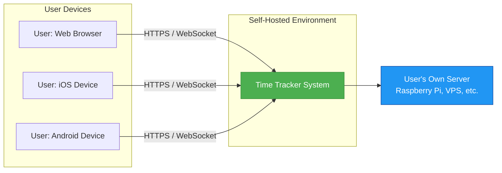
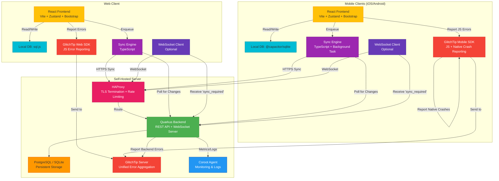
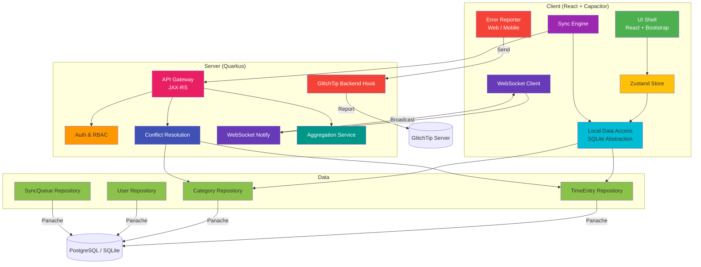
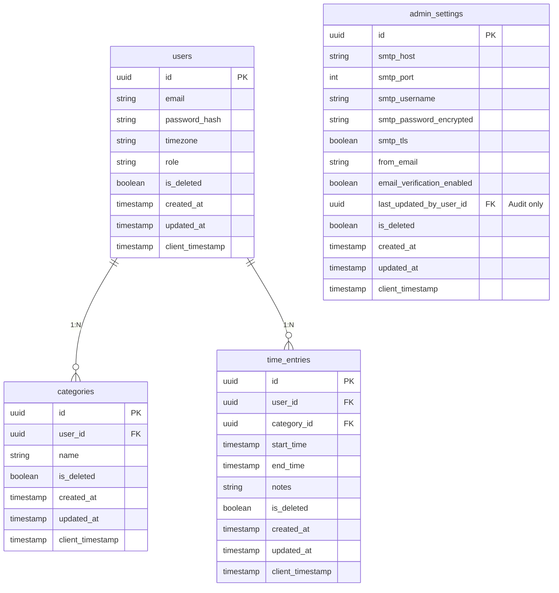
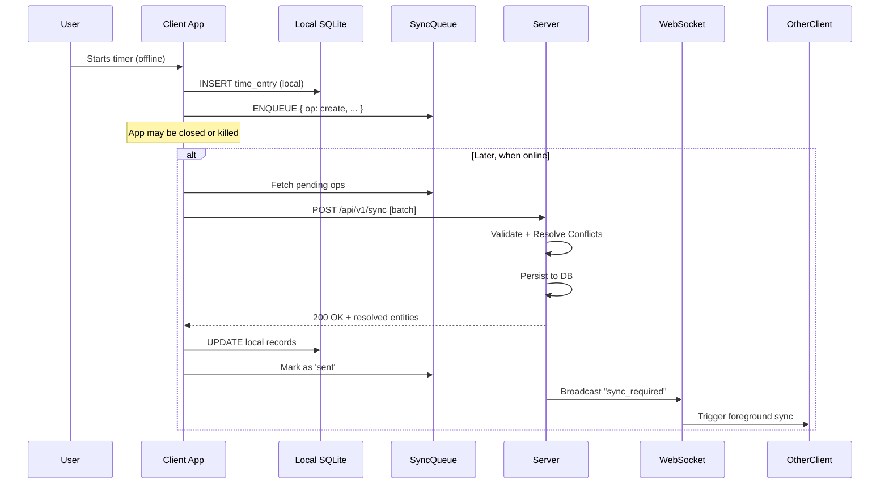

# Design and Architecture Document: Time Tracker System

## 1\. Introduction

### 1.1 Purpose of This Document

### 1.2 Scope

### 1.3 Definitions, Acronyms, and Abbreviations

### 1.4 References

### 1.5 Document Conventions

## 2\. Architectural Goals, Constraints, and Technology Stack

### 2.1 Quality Attribute Scenarios

### 2.2 Key Design Principles

### 2.3 Technical and Operational Constraints

### 2.4 Selected Technology Stack

## 3\. High-Level Architecture Overview

### 3.1 Architectural Style(s) Used

### 3.2 Context Diagram

### 3.3 Container Diagram

## 4\. Component Architecture

### 4.1 Client Layer

### 4.2 Application Server

### 4.3 Data Layer

### 4.4 Component Diagram

## 5\. Data Architecture

### 5.1 Conceptual Data Model

### 5.2 Logical Data Schema

### 5.3 UUID-Based Identity Strategy

### 5.4 Soft Delete & Tombstone Propagation

### 5.5 Local vs. Server Data Partitioning

## 6\. Synchronization Design

### 6.1 Sync Engine Workflow

### 6.2 Conflict Detection & Resolution Logic

### 6.3 Sync Queue Structure

### 6.4 Sequence Diagram

## 7\. Security Architecture

### 7.1 Authentication Flow

### 7.2 Secure Token Storage

### 7.3 Data Isolation

### 7.4 Password Hashing

### 7.5 Threat Model Summary

## 8\. Deployment Architecture

### 8.1 Self-Hosting Topology

### 8.2 Docker Compose Setup

### 8.3 Environment Support Matrix

### 8.4 Health & Monitoring Endpoints

### 8.5 Deployment Diagram

## 9\. Cross-Cutting Concerns

### 9.1 Error Handling & Logging

### 9.2 Internationalization

### 9.3 Accessibility

### 9.4 Performance Optimizations

## 10\. Quality Assurance and Software Verification

### 10.1 Testing Strategy

### 10.2 Test Environments

### 10.3 Key Test Scenarios

### 10.4 Performance & Load Validation

### 10.5 Security Verification

### 10.6 Compliance & Auditability

### 10.7 Monitoring & Observability

## 11\. Open Issues and Future Considerations

### 11.1 Known Ambiguities

### 11.2 Potential Extensions

# 1\. Introduction

## 1.1 Purpose of This Document

This Design and Architecture Document (DAD) provides a comprehensive technical blueprint for the implementation of the **Time Tracker System**, as defined in the accompanying Functional Requirements Document (FRD). It translates functional and non-functional requirements into concrete architectural decisions, component specifications, data models, and synchronization strategies.

The primary audience includes software engineers, DevOps personnel, QA specialists, and technical stakeholders involved in the development, deployment, and maintenance of the system. This document serves as the authoritative reference for:

- Selecting and justifying the technology stack  
- Defining system boundaries and interactions  
- Ensuring alignment with core principles: **Local-First**, **Offline-First**, **Self-Hostability**, and **Data Sovereignty**  
- Guiding secure, testable, and maintainable implementation

## 1.2 Scope

This document covers the end-to-end architecture of the Time Tracker System, including:

- The **unified frontend** built with React, Vite, and Capacitor, supporting Web, iOS, and Android from a single codebase  
- The **Quarkus-based backend**, designed for low-resource self-hosted environments  
- The **synchronization engine** that enables robust offline operation and eventual consistency  
- The **data model**, storage strategy, and conflict resolution logic  
- Security, deployment, observability, and quality assurance mechanisms

It explicitly addresses the hybrid data strategy (7-day local cache \+ full server history), role-based access control, and containerized deployment via Docker.

Out of scope are:

- UI/UX wireframes or visual design assets  
- Third-party integrations (e.g., calendar sync, billing)  
- Native desktop applications (Windows/macOS/Linux)

## 1.3 Definitions, Acronyms, and Abbreviations

| Term | Definition |
| :---- | :---- |
| **Local-First** | Architectural pattern where the client reads/writes to local storage first; the server is a sync target, not the primary data source during interaction |
| **Sync Queue** | Client-side persistent queue of pending operations (create/update/delete) to be sent to the server when online |
| **UUID** | Universally Unique Identifier (v4); used as primary key for all entities to enable offline creation |
| **RBAC** | Role-Based Access Control; security model restricting access based on user roles |
| **JWT** | JSON Web Token; used for stateless authentication between client and server |
| **Capacitor** | Cross-platform runtime for building native mobile apps with web technologies |
| **Quarkus** | Kubernetes-native Java framework optimized for containers and fast startup |
| **Soft Delete** | Logical deletion by marking a record as deleted (`is_deleted = true`) instead of physical removal, enabling propagation across devices |

## 1.4 References

1. **Functional Requirements Document (FRD)** – *Pasted\_Text\_1769347788505.txt*  
2. IEEE Std 1471-2000 – *Recommended Practice for Architectural Description of Software-Intensive Systems*  
3. Quarkus Documentation – [https://quarkus.io](https://quarkus.io)  
4. Capacitor Documentation – [https://capacitorjs.com](https://capacitorjs.com)  
5. RFC 4122 – *UUID Standard*  
6. ISO 8601 – *Date and Time Format Standard*

## 1.5 Document Conventions

- **Diagrams**: All architecture and sequence diagrams are rendered using **Mermaid.js** syntax.  
- **Code & Config**: Snippets for configuration files (e.g., `docker-compose.yml`, `application.properties`) are provided where relevant.  
- **Requirements Traceability**: Key decisions reference FRD sections (e.g., “FR-CORE-05.3”) to ensure alignment.  
- **Technology Names**: Specific frameworks and tools are capitalized (e.g., React, Quarkus, PostgreSQL).  
- **User Roles**: Referenced as defined in FRD Chapter 3.2: *Guest*, *Standard User*, *Administrator*.

Understood. Below is the **updated Chapter 2: Architectural Goals, Constraints, and Technology Stack**, incorporating your specified additions:

- **Frontend UI**: Bootstrap (as a component/CSS library)  
- **State Management**: Zustand  
- **Backend**: Quarkus (Java 21+)  
- **Icons**: Material Symbols  
- **Error Reporting**: Sentry  
- **Monitoring & Log Aggregation**: Coroot

All choices are aligned with the FRD’s principles of self-hostability, offline-first UX, and operational simplicity.

---

Thank you for the clarification.

However, there appears to be a small terminology mix-up: **“Webshots”** is not a standard technology. Based on context, you likely mean **WebSockets** (a real-time bidirectional communication protocol) and possibly **Web Push Notifications** (for background alerts). Since the FRD emphasizes **local-first** and **offline resilience**, real-time sync should be **optional and additive**—not core to the MVP data model.

We’ll interpret your request as:

**Add optional Real-Time Sync using WebSockets, with support for push-style notifications to connected clients.**

This will be treated as a **v2 capability** but designed in a way that doesn’t compromise the offline-first foundation.

Below is the **updated Chapter 2**, incorporating **WebSocket-based real-time sync** and clarifying its scope.

---

# 2\. Architectural Goals, Constraints, and Technology Stack

## 2.1 Quality Attribute Scenarios

The architecture is driven by the following quality attribute scenarios derived from the FRD:

| Scenario | Description | Architectural Response |
| :---- | :---- | :---- |
| **Offline Continuity** | User starts a timer on a subway with no connectivity. | Local-first data layer; all writes go to local SQLite first; sync engine queues operations. |
| **Eventual Consistency** | User edits the same record on mobile (offline) and web (online). | “Last Client Timestamp Wins” conflict resolution; UUID-based entities; soft deletes for propagation. |
| **Self-Hostability** | User deploys the system on a Raspberry Pi with 1GB RAM. | Lightweight Quarkus backend; Docker Compose support; optional SQLite mode; minimal external dependencies. |
| **Data Sovereignty** | User demands full ownership and portability of their data. | Full CSV/JSON export; account deletion purges all PII; no telemetry or cloud lock-in. |
| **Responsive UX** | User expects instant feedback when starting/stopping a timer. | Optimistic UI updates; local state management via Zustand; background sync decoupled from UI thread. |
| **Secure Multi-Tenancy** | Two users on the same instance must never see each other’s data. | Row-level isolation via `user_id` in all queries; RBAC enforced at API layer; JWT-scoped access. |
| **Real-Time Awareness (v2)** | User switches from mobile to desktop and wants near-instant visibility of recent changes. | Optional WebSocket channel for live sync notifications; clients reconcile via standard sync flow upon receipt. |

## 2.2 Key Design Principles

- **Local-First**: The client is the primary interaction surface. All user actions are persisted locally before any network call.  
- **Offline-First UX**: The application assumes intermittent or absent connectivity. Core features (timer, category edit, timeline view) work without network.  
- **Self-Hostability**: The entire stack must run in a single Docker container or Compose setup, with no mandatory external services (e.g., no Firebase, Auth0, or SaaS).  
- **Data Sovereignty**: Users own their data. The system provides full export, deletion, and zero hidden analytics.  
- **Simplicity & Maintainability**: Minimal dependencies; clear separation of concerns; testable components.  
- **Progressive Enhancement**: Real-time features are **opt-in** and **non-blocking**—the system remains fully functional without them.

## 2.3 Technical and Operational Constraints

- **No External Cloud Dependencies**: The system must function entirely within the user’s infrastructure.  
- **Single-Command Deployment**: Must be deployable via `docker-compose up` with sensible defaults.  
- **Database Flexibility**: Must support both **SQLite** (for single-user/lightweight) and **PostgreSQL** (for multi-user/production) via configuration.  
- **Mobile Resource Limits**: The Capacitor app must operate efficiently on low-end Android/iOS devices (≤50MB RAM usage, minimal battery drain).  
- **Timezone Correctness**: All time aggregation must respect the user’s configured timezone, not UTC.  
- **HTTPS Enforcement**: All external traffic must be served over TLS; certificate management must be self-contained.  
- **Rate Limiting**: The system must protect against brute-force and DoS attacks at the ingress layer.  
- **Real-Time Sync (Optional)**: WebSocket-based notifications may be used to *signal* changes, but **data synchronization still flows through the standard REST \+ sync queue mechanism** to preserve offline consistency.

## 2.4 Selected Technology Stack

| Layer | Technology | Justification |
| :---- | :---- | :---- |
| **Frontend Framework** | **React \+ Vite** | Fast HMR, optimized builds, modern TSX ecosystem; ideal for shared logic across platforms. |
| **UI Components** | **Bootstrap 5** | Responsive, accessible, and themable CSS framework; reduces custom styling effort while ensuring cross-device consistency. |
| **State Management** | **Zustand** | Lightweight, hook-based global state store; avoids React Context boilerplate; ideal for managing sync queue, auth state, and optimistic UI. |
| **Icon Library** | **Material Symbols** | Official Google icon set; supports outlined/filled/rounded styles; lightweight via font or SVG; consistent with modern design language. |
| **Cross-Platform Runtime** | **Capacitor** | Enables native iOS/Android apps from the same React codebase; provides secure storage, background tasks, and device APIs. |
| **Local Database** | **SQLite** – Web: \`sql.js\` – Mobile: \`@capacitor/sqlite\` | Full SQL support offline; consistent schema across platforms; lightweight and embedded. |
| **Backend Framework** | **Quarkus (Java 21+)** | Sub-millisecond startup, low memory footprint (\~50MB), GraalVM native support, ideal for containers and self-hosting. Built-in health checks and metrics. |
| **API Layer** | **JAX-RS \+ RESTEasy** | Standard, type-safe REST endpoints; integrates seamlessly with Quarkus. |
| **Real-Time Layer** | **Quarkus WebSocket Extension** | Native WebSocket support in Quarkus; enables lightweight, authenticated channels for sync notifications. |
| **Data Access** | **Hibernate ORM with Panache** | Supports UUIDs, soft deletes, and multi-tenancy; abstracts PostgreSQL/SQLite differences. |
| **Authentication** | **JWT (Access \+ Refresh Tokens)** | Stateless, scalable, compatible with mobile and web token storage strategies. |
| **Token Storage** | – Web: **HttpOnly \+ Secure Cookies** – Mobile: \*\*Capacitor Secure Storage (Keychain/Keystore)\*\* | Mitigates XSS and extraction risks per platform best practices. |
| **Error & Crash Tracking** | **GlitchTip** | Open-source, Sentry-compatible error monitoring; fully self-hostable; captures frontend (React) and backend (Quarkus) exceptions with offline queuing support. |
| **Monitoring & Logs** | **Coroot** | Open-source observability platform; auto-discovers services in Docker; provides health dashboards, log aggregation, and performance insights without vendor lock-in. |
| **Ingress & Security** | **HAProxy** | Lightweight, high-performance TCP/HTTP load balancer and reverse proxy. Handles: – \*\*TLS termination\*\* (with ACME or manual cert) – \*\*Rate limiting\*\* (per IP/user) – Routing to Quarkus (HTTP \+ WebSocket) |
| **Containerization** | **Docker \+ Docker Compose** | One-command deployment; supports both SQLite and PostgreSQL profiles via `docker-compose.yml` variants. |
| **Build & CI** | **GitHub Actions** | Automates testing, Docker image build, and release tagging. |

**Note on Real-Time Sync**:  
WebSockets are used **only to notify** connected clients that new data is available (e.g., `"sync_required": true`). The actual data transfer and conflict resolution **still occur via the standard REST \+ sync queue mechanism**. This ensures correctness in offline scenarios and avoids duplicating sync logic.

This approach delivers **real-time awareness** without sacrificing the **robustness of the local-first model**.

Excellent point. Mobile and web clients have different error-reporting capabilities—especially around **native crashes**, **background sync failures**, and **secure storage access**. We’ll update the architecture to reflect **separate error-tracking paths** for **Web** and **Mobile**, while still using **GlitchTip** as the unified backend.

Below is the **revised Chapter 3: High-Level Architecture Overview**, with clear differentiation between web and mobile error reporting.

---

# 3\. High-Level Architecture Overview

This chapter presents the system’s high-level structure using architectural views aligned with the **C4 model** (Context, Containers). It defines system boundaries, external actors, and major runtime components, while respecting the core principles of **local-first**, **offline resilience**, and **self-hostability**.

## 3.1 Architectural Style(s) Used

The Time Tracker System employs a **hybrid architectural style** combining:

- **Local-First Client Architecture**: Each client (Web, iOS, Android) maintains a full local replica of recent data (7-day window) in SQLite. All user interactions are processed against this local store first.  
- **Eventual Consistency with Conflict Resolution**: Changes are synchronized to a central server when connectivity is available. Conflicts are resolved using deterministic rules (“last client timestamp wins”).  
- **Client-Server over REST \+ WebSockets**: Primary data exchange occurs via RESTful APIs. An optional WebSocket channel provides real-time notifications to accelerate sync awareness.  
- **Containerized Deployment**: The backend stack (HAProxy, Quarkus, GlitchTip, Coroot) is packaged as a set of Docker containers orchestrated via Docker Compose.

This hybrid approach ensures offline usability while enabling multi-device synchronization and self-hosted operation.

## 3.2 Context Diagram


**Actors**:

- **Web User**: Interacts via browser; errors captured via JavaScript exception handlers.  
- **Mobile Users (iOS/Android)**: Use native Capacitor apps; errors include JavaScript exceptions **and** native crashes (e.g., SQLite plugin failure, background task termination).

## 3.3 Container Diagram


**Key Distinctions**:

- **Web Client**:  
    
  - Uses `sql.js` for in-browser SQLite.  
  - Error reporting limited to **JavaScript exceptions** and **network failures**.  
  - GlitchTip Web SDK captures unhandled promise rejections, render errors, and sync failures.


- **Mobile Clients (iOS/Android)**:  
    
  - Use native `@capacitor/sqlite` plugin (bridges to platform SQLite).  
  - Can experience **native-layer crashes** (e.g., plugin failure, background task kill).  
  - GlitchTip Mobile SDK (via Capacitor plugin) captures **both JavaScript and native stack traces**.  
  - Background sync tasks are monitored separately for reliability.


- **GlitchTip Server**:  
    
  - Runs self-hosted alongside the app.  
  - Aggregates errors from **Web**, **Mobile**, and **Quarkus Backend** into a single dashboard.  
  - Supports tagging by platform (`web`, `ios`, `android`, `backend`) for filtering.

This design ensures comprehensive observability across all platforms while maintaining full data ownership and alignment with the self-hosted philosophy.

# 4\. Component Architecture

This chapter decomposes the major containers (from Chapter 3\) into logical software components, specifying their responsibilities, interfaces, and interactions. The design adheres to separation of concerns, testability, and platform-specific constraints for web and mobile.

## 4.1 Client Layer

The client layer is a **unified React application** built with Vite and deployed across three platforms via Capacitor: **Web**, **iOS**, and **Android**. Despite shared business logic, platform-specific adaptations are made for storage, background execution, and error reporting.

### Key Components:

- **UI Shell (React \+ Bootstrap)**  
  Renders responsive views using Bootstrap 5 components and Material Symbols icons. Uses React hooks and Zustand for state-driven rendering. Fully offline-capable.  
    
- **Zustand Store**  
  Manages global application state:  
    
  - Authentication status  
  - Current user profile  
  - Active timer state  
  - Sync queue status  
  - Optimistic UI updates (e.g., local category creation)


- **Local Data Access Layer**  
  Abstracts SQLite access behind a unified interface:  
    
  - **Web**: Uses `sql.js` (in-memory or persisted via IndexedDB)  
  - **Mobile**: Uses `@capacitor/sqlite` plugin (native SQLite)  
  - Exposes typed repositories (e.g., `TimeEntryRepo`, `CategoryRepo`) with CRUD \+ query methods


- **Sync Engine**  
  A TypeScript service that:  
    
  - Listens to local DB changes (via repository events)  
  - Enqueues operations (create/update/delete) with metadata:  
    - `entity_id` (UUID)  
    - `client_timestamp` (ISO 8601 with timezone)  
    - `operation_type`  
    - `payload`  
  - Persists queue in local SQLite (`sync_queue` table)  
  - On network availability, batches and sends to `/api/v1/sync` (POST)  
  - Handles responses: marks as synced or retries on failure  
  - Supports manual and automatic (background) sync modes


- **WebSocket Client (Optional)**  
    
  - Connects to `/ws/notify` after authentication  
  - Receives lightweight messages like `{ "type": "sync_required", "user_id": "..." }`  
  - Triggers a **foreground sync** if app is active; queues signal if in background  
  - Automatically reconnects on disconnect


- **Error Reporter**  
  Platform-specific integration with GlitchTip:  
    
  - **Web**: Initializes GlitchTip JS SDK; captures unhandled errors, promise rejections, and manual `captureException()` calls  
  - **Mobile**: Uses a custom Capacitor plugin wrapping GlitchTip’s native SDKs (iOS/Android), capturing both JavaScript and native crashes (e.g., SQLite plugin failures)

## 4.2 Application Server

The backend is a **Quarkus (Java 21+)** application exposing REST and WebSocket endpoints. It is stateless, container-friendly, and optimized for low-resource self-hosting.

### Key Components:

- **API Gateway (JAX-RS Resources)**  
  RESTful endpoints under `/api/v1/`:  
    
  - `AuthResource`: Login, logout, refresh token  
  - `UserResource`: Profile, export, delete account  
  - `TimeEntryResource`: CRUD \+ aggregation (daily/weekly goals)  
  - `CategoryResource`: Manage categories  
  - `SyncResource`: Accepts batched sync operations; returns server state \+ conflicts


- **Authentication & RBAC Module**  
    
  - Validates JWT tokens (signed with HS256)  
  - Enforces role-based access:  
    - `Guest`: Can register/login  
    - `Standard User`: Full access to own data  
    - `Admin`: User management (in multi-user mode)  
  - Uses secure cookie (`HttpOnly`, `Secure`, `SameSite=Strict`) for web; header-based for mobile


- **Conflict Resolution Service**  
  Processes incoming sync batches:  
    
  - Compares `client_timestamp` of local vs. server record  
  - Applies “last client timestamp wins” rule  
  - Handles soft deletes: propagates `is_deleted = true` with tombstone  
  - Returns resolved entities to client for reconciliation


- **WebSocket Notification Service**  
    
  - Maintains authenticated WebSocket sessions per user  
  - On successful sync write, broadcasts `sync_required` to all other active sessions of the same user  
  - Does **not** transmit data—only signals that a sync is needed


- **Aggregation & Reporting Service**  
  Computes time summaries (daily, weekly) respecting user timezone  
    
  - Caches results for 5 minutes to reduce load  
  - Used by timeline and analytics views


- **GlitchTip Integration**  
    
  - Quarkus extension reports unhandled exceptions to self-hosted GlitchTip  
  - Includes user ID (when available) and request context for debugging

## 4.3 Data Layer

The data layer provides a consistent abstraction over two database engines, selected at deployment time.

### Key Aspects:

- **Database Abstraction**  
    
  - **Profile-based configuration**:  
    - `prod-sqlite`: Embedded SQLite (single-user mode)  
    - `prod-postgres`: PostgreSQL (multi-user mode)  
  - Same JPA entities used in both profiles


- **Core Entities (Panache)**  
  All entities use UUID primary keys and include:  
    
  - `id: UUID`  
  - `user_id: UUID` (for multi-tenancy)  
  - `created_at`, `updated_at`  
  - `is_deleted: boolean` (soft delete flag)  
  - `client_timestamp: Instant` (for conflict resolution)


- **Multi-Tenancy Enforcement**  
  Every query includes `WHERE user_id = :currentUserId`, enforced at the repository level. No row-level security (RLS) in DB—logic is application-enforced for portability.  
    
- **Indexing Strategy**  
    
  - `(user_id, client_timestamp)` for efficient sync diffing  
  - `(user_id, date_trunc('day', start_time))` for daily aggregations

## 4.4 Component Diagram


This component decomposition ensures modularity, testability, and clear ownership—enabling independent evolution of frontend, sync logic, and backend services while preserving the local-first guarantee.  
You're absolutely right — **`admin_settings`** should represent **system-wide configuration**, not be tied to a specific user. While an admin *user* may modify it, the settings themselves belong to the **system**, not to any individual.

We’ll correct this by:

- Removing the `owner_user_id` foreign key  
- Treating `admin_settings` as a **singleton system entity**  
- Using `updated_by_user_id` (optional) only for audit logging, not ownership

Below is the **revised Chapter 5: Data Architecture** with this correction.

---

# 5\. Data Architecture

This chapter defines the data model, storage strategy, and synchronization semantics that enable **offline-first operation**, **multi-device consistency**, and **self-hosted data ownership**. The design ensures that all entities can be created offline, synchronized reliably, and reconciled without data loss.

## 5.1 Conceptual Data Model

The core domain consists of four primary entities:

- **User**: Represents an authenticated account. Supports single-user (personal) and multi-user (shared instance) modes.  
- **Category**: A user-defined label for time entries (e.g., “Work”, “Exercise”). Can be renamed or deleted.  
- **TimeEntry**: A recorded interval with start/end timestamps, associated category, and optional notes.  
- **AdminSettings**: System-wide configuration managed by any user with the `admin` role. Includes SMTP settings for email delivery (e.g., password reset, email verification).

All user-owned entities are **scoped to a single user** and must never be visible to others. Deletions are **logical (soft deletes)** to enable propagation across devices. **AdminSettings** is a **system-level singleton**, accessible only to administrators and **not associated with any specific user**.

## 5.2 Logical Data Schema

The following diagram shows the relational schema used on both client (SQLite) and server (PostgreSQL/SQLite). All tables use **UUIDs as primary keys** to support offline creation.


**Key Notes**:

- `admin_settings` is a **system-wide singleton** — only one active record (`is_deleted = false`) exists per instance.  
- It is **not owned by any user**; any user with `role = 'admin'` can update it.  
- `last_updated_by_user_id`: Optional foreign key to `users.id` for **audit purposes only** (not for access control).  
- `smtp_password_encrypted`: Stored encrypted at rest using a server-managed key (e.g., via Quarkus Vault or filesystem-based secret).  
- **Not synced to clients**: This table exists **only on the server** and is never replicated to mobile or web local databases.

## 5.3 UUID-Based Identity Strategy

- All primary keys are **UUIDs (v4)**, generated by the client at creation time (for user-owned entities).  
- **Exception**: `admin_settings.id` is a UUID but is **created once by the server** during first-run initialization (e.g., on first admin login or setup wizard).  
- UUIDs are stored as `TEXT` in SQLite and `UUID` type in PostgreSQL (mapped via Hibernate).  
- Foreign keys (e.g., `category_id` in `time_entries`) also use UUIDs, enabling referential integrity even when parent entities are created offline.

## 5.4 Soft Delete & Tombstone Propagation

- When a user deletes a record, it is **not removed** from the database. Instead:  
  - `is_deleted = true`  
  - `client_timestamp` is updated to the deletion time  
- During sync:  
  - The server applies the same soft-delete logic  
  - Deleted records are included in sync responses so other clients can remove them locally  
- **Tombstones are retained indefinitely** to ensure eventual consistency across all devices.  
- **AdminSettings**: Soft delete is used only during configuration updates (to keep history); the system always uses the latest non-deleted record.

## 5.5 Local vs. Server Data Partitioning

To balance performance and functionality, the client maintains a **7-day local cache**:

- **Local SQLite (Client)**:  
    
  - Stores **all pending operations** (sync queue)  
  - Stores **full timeline for the last 7 days**  
  - Stores **all user categories**  
  - Does **not store historical data beyond 7 days**  
  - **Does not store `admin_settings`** — this is server-only


- **Server Database**:  
    
  - Stores **complete history** for all time entries  
  - Stores **all user accounts**  
  - Stores **exactly one active `admin_settings` record**  
  - Serves aggregated reports and handles email delivery using SMTP config  
  - Provides full data export (CSV/JSON)


- **Sync Behavior**:  
    
  - Clients sync only user-scoped data  
  - Email features (e.g., password reset) are triggered server-side using the current `admin_settings`  
  - Admin UI (web-only) allows editing system settings; changes take effect immediately

This design ensures **secure, auditable, and shared administrative control** while maintaining strict data isolation for regular users.

# 6\. Synchronization Design

This chapter details the **offline-first synchronization engine** that enables seamless multi-device time tracking while preserving data integrity, handling conflicts, and operating reliably under intermittent connectivity. The design ensures that users can work offline indefinitely and reconcile changes safely when reconnected.

## 6.1 Sync Engine Workflow

The sync process follows a **client-driven, queue-based model**:

1. **Local Write**: All user actions (create/update/delete) are immediately written to the local SQLite database with a client-generated `client_timestamp`.  
2. **Queue Enqueue**: The operation is added to a persistent `sync_queue` table with metadata:  
   - `entity_id` (UUID)  
   - `entity_type` (`time_entry`, `category`)  
   - `operation` (`create`, `update`, `delete`)  
   - `payload` (full entity snapshot)  
   - `client_timestamp`  
   - `status` (`pending`, `sent`, `failed`, `conflict`)  
3. **Background Sync**: When online, the client periodically:  
   - Collects all `pending` operations  
   - Sends them as a batch to `/api/v1/sync` (POST)  
   - Waits for server response  
4. **Server Processing**: The server:  
   - Validates ownership (`user_id`)  
   - Applies conflict resolution logic  
   - Persists changes  
   - Returns resolved entities and any conflicts  
5. **Client Reconciliation**: The client:  
   - Updates local records with server-confirmed values  
   - Marks queue items as `sent`  
   - Triggers UI refresh  
6. **WebSocket Signal (Optional)**: If another device syncs, the server sends a `sync_required` message via WebSocket to other active sessions of the same user, prompting a foreground sync.

**Note**: Sync is **not real-time data push**—it’s a **notification to pull**. This preserves offline correctness.

## 6.2 Conflict Detection & Resolution Logic

Conflicts occur when the same entity is modified on two devices while offline.

### Conflict Detection

- Each entity has a `client_timestamp` (ISO 8601 with timezone offset).  
- On sync, the server compares the incoming `client_timestamp` with the stored one.

### Resolution Rule

- **“Last Client Timestamp Wins”**: The operation with the later `client_timestamp` overwrites the earlier one.  
- **Tie-breaking**: If timestamps are identical (rare), the server uses lexicographic comparison of `entity_id` as a deterministic fallback.

### Special Cases

- **Category Deletion vs. Time Entry Update**:  
  If a category is deleted on Device A, but Device B updates a time entry using that category while offline, the time entry retains the `category_id`. The UI will show “(Deleted Category)” until the user reassigns it.  
- **Soft Deletes**:  
  A `delete` operation sets `is_deleted = true` and updates `client_timestamp`. This tombstone propagates to all devices.

This strategy ensures **deterministic, automatic resolution** without user intervention, while preserving auditability.

## 6.3 Sync Queue Structure

The client maintains a dedicated SQLite table for pending operations:

```sql
CREATE TABLE sync_queue (

    id TEXT PRIMARY KEY,               -- UUID

    entity_id TEXT NOT NULL,           -- UUID of affected entity

    entity_type TEXT NOT NULL,         -- 'time_entry' | 'category'

    operation TEXT NOT NULL,           -- 'create' | 'update' | 'delete'

    payload TEXT NOT NULL,             -- JSON-serialized entity

    client_timestamp TEXT NOT NULL,    -- ISO 8601

    status TEXT NOT NULL DEFAULT 'pending', -- 'pending' | 'sent' | 'failed' | 'conflict'

    created_at TEXT NOT NULL,

    updated_at TEXT NOT NULL

);


```
);

- **Persistence**: Survives app restarts and device reboots.  
- **Ordering**: Operations are sent in `client_timestamp` order to preserve causality.  
- **Retry Logic**: Failed batches are retried with exponential backoff (max 3 attempts), then marked `failed` for manual retry.  
- **Cleanup**: Items with `status = 'sent'` are purged after 7 days.

## 6.4 Sequence Diagram

The following diagram illustrates a typical offline-to-sync flow:


This sequence demonstrates how the system guarantees **durability**, **eventual consistency**, and **cross-device awareness**—all while maintaining a responsive, offline-capable user experience.  
